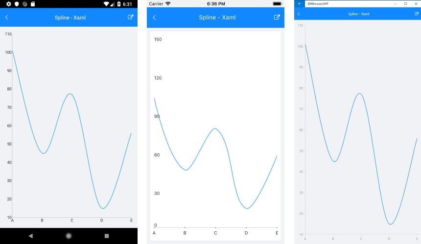
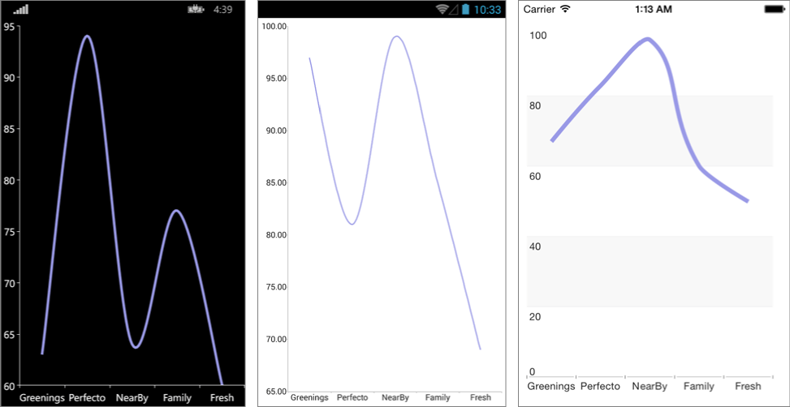

# Spline Series

## Overview

**RadCartesianChart** visualizes each data item from the **LineSeries** and connects them with curved line segments. The **SplineSeries** extend **LineSeries**, so they are also **CategoricalSeries** and require one **CategoricalAxis** and one **NumricalAxis**.

## Features

**SplineSeries** extend [**LineSeries**]() so they provide the same properties to change their style:

- **Stroke** (Color): changes the color used to draw lines.
- **StrokeThickness** (double): changes the width of the lines.

## Example

Here is an example how to create RadCartesianChart with Spline Series:

First, create the needed business objects, for example:

<snippet id='categorical-data-model'/>

Then create a ViewModel:

<snippet id='chart-series-categorical-data-view-model'/>

Finally, use the following snippet to declare a RadCartesianChart with Spline Series in XAML and in C#:

<snippet id='chart-series-spline-xaml'/>
<snippet id='chart-series-spline-csharp'/>

Where the **telerikChart** namespace is the following:

<snippet id='xmlns-telerikchart'/>
<snippet id='ns-telerikchart'/>

And here is the result:



>important A sample Spline Series example can be found in the Chart/Series folder of the [SDK Samples Browser application]().

### Customization Example

Here we make some customization:

```C#
	var series = new SplineSeries 
	{ 
		Stroke = new Color(0.6, 0.6, 0.9), 
		StrokeThickness = 5 
	};
```



## See Also

- [ScatterArea Series]()
- [ScatterLine Series]()
- [ScatterPoint Series]()