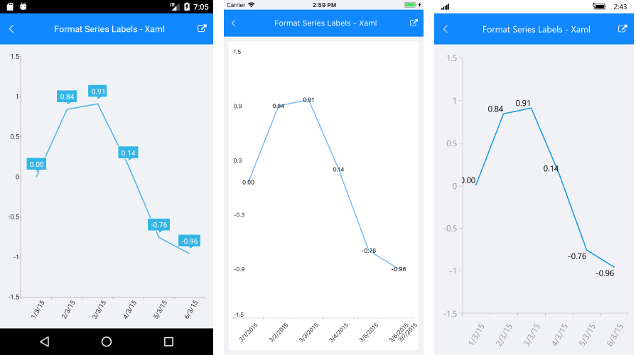

# Common Features

* **ItemsSource**(IList): Defines the data set that will fill the series data points. 
* **DisplayName**(string): The display name of the series.

## Selection

* **AllowSelect**(bool): Specifies whether the series is selectable. If the property value is `true`, the selection is handled by the chart selection behavior.  
* **IsSelected**(bool): Specifies whether the series is selected.

## Labels customization

RadChart provides the option to display data point labels in the plot area through the **ShowLabels** property of the ChartSeries.

You could customize the series labels text using the properties below:

* **ShowLabels**(bool): Defines whether the series will display labels for each plotted data point.
* **LabelBinding**(PropertyNameDataPointBinding): Allows the user to bind the series labels to a property of the data point item.
* **LabelFormat**(string): Sets label format string such as `"N"`, `"P2"`.
* **LabelFormatter**(ILabelFormatter): Allows custom series label formatting. 

### Example 

Here is a quick example how you could apply **LabelFormat** to a LineSeries:

First, create the needed business objects, for example:

<snippet id='temporal-data-model'/>

Then create a ViewModel:

<snippet id='chart-customization-formatserielabels-view-model'/>

Finally, use the following snippet to declare a RadCartesianChart with Line Series in XAML and in C#:

<snippet id='chart-customization-formatserieslabels-xaml'/>
<snippet id='chart-customization-formatserieslabels-csharp'/>

And the result is:

>tip You can find detailed information about the supported numeric formats here: [Standard Numeric Format Strings](https://docs.microsoft.com/en-us/dotnet/standard/base-types/standard-numeric-format-strings).

## Categorical Series Features

### Data Binding

All categorical series have **CategoryBinding** and **ValueBinding** properties. These properties are of **PropertyNameDataPointBinding** and specify the name  of the property from the data model used by the chart to plot the corresponding visual points.

### Combining

The categorical series could be combined. Several combining strategies are supported. You can take a look at the [Grouping example]().

## Scatter Series Common Features

### Data Binding

Scatter series provide **XValueBinding** and **YValueBinding** properties for data binding to a view model. These properties are of **PropertyNameDataPointBinding** and specify the name  of the property from the data model used by the chart to plot the corresponding visual points.

## See Also

- [Annotations]()
- [Chart Legend]()
- [Null Values]()
