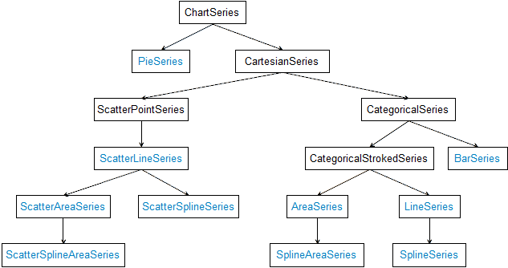

# Overview #

The data visualization in RadChart is done by a hierarchy of classes that inherit from the ChartSeries class. Each series has a collection of data points, that is the view model of the data. A series may have its data populated by data-binding to an arbitrary IEnumerable instance through the ItemsSource property.

## Series Class Hierarchy ##

Concrete series types are available for specific charts. For example, there is a set of CartesianSeries applicable in the context of a RadCartesianChart. Here is the hierarchy of all series:

Here are listed all supported series grouped by the chart types that can use them:

### CartesianChart

- **CategoricalSeries**

    - [Bar Series]()
    - [Line Series]()
    - [Spline Series]()
    - [Area Series]()
    - [SplineArea Series]()
	
- **ScatterSeries**

    - [ScatterPoint Series]()
    - [ScatterLine Series]()
    - [ScatterSpline Series]()
    - [ScatterArea Series]()
    - [ScatterSplineArea Series]()

### PieChart

- [Pie Series]() 
- [Donut Series]()

### Financial Chart

- [Ohlc Series]() 
- [Candlestick Series]()
- [Financial Series]() 

## See Also

- [Annotations]()
- [Chart Legend]()
- [Null Values]()
