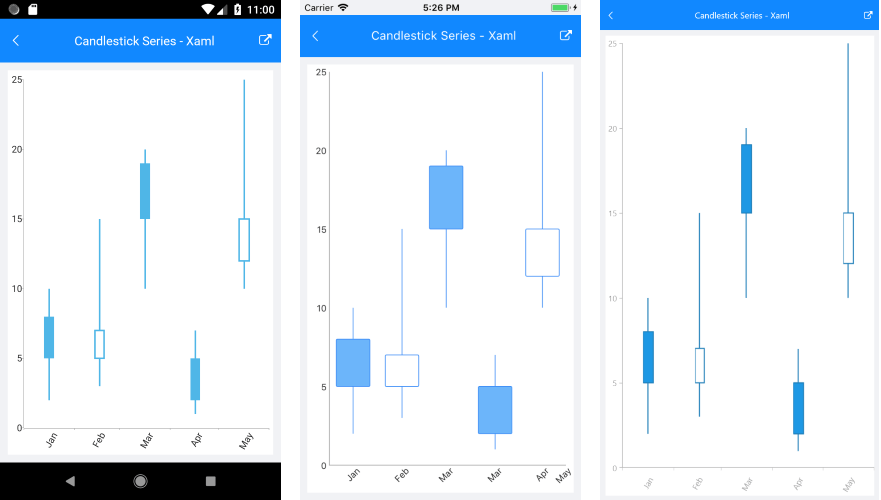

# Candlestick Series

## Overview

**RadCartesianChart** visualizes each data point from the **CandlestickSeries** as a visual that resembles a candlestick. This is a typical financial series that can be used to visualize the state of a market for a period of time. The series operates with a special kind of data in the form of four parameters defining the stock market - **open**, **high**, **low**, and **close**. The high and low values show the price range (the highest and lowest prices) over one unit of time. The open and close values indicate the opening and closing price of the stock for the corresponding period

## Example

Here is an example of how to create a basic RadCartesianChart with CandlestickSeries in XAML and C#:

<snippet id='chart-series-candlestick-xaml'/>
<snippet id='chart-series-candlestick-csharp'/> 

Add the following namespace:

<snippet id='xmlns-telerikchart'/>

Here is how the business model is defined:

<snippet id='chart-ohlc-datapoint-csharp'/>

And here is the result:

>important **SDK Browser** application contains an example that shows how to use the CandlestickSeries. You can find the application in the **Examples** folder of your local **Telerik UI for Xamarin** installation.

## See Also

- [Ohlc Series Overview]()
- [Financial Indicators]()

