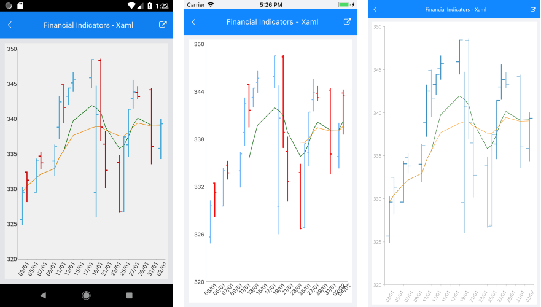

# Financial Indicators

## Overview

The financial, or also called stock indicators, are mainly used for keeping track of stock prices and patterns of price changes over time. You can find further information about what indicators are and what they are being used for by following this link: [Short information about financial indicators](https://www.investopedia.com/terms/t/technicalindicator.asp).

In terms of using the indicators in the RadCartesianChart, you will need to add them as you would add any other Cartesian series. Every indicator has a related formula by which it calculates the expected result. All you need to do is provide the needed data.

There are two types of indicators in terms of setting their properties and getting them ready for displaying your stock data:

Indicators that have a category and a value(usually the close) bindings as well as one or more periods. Here are the available indicators:

* **OscillatorIndicator** 
* **RateOfChangeIndicator**
* **RelativeStrengthIndexIndicator**
* **TrixIndicator**
* **WeightedMovingAverageIndicator**
* **ExponentialMovingAverageIndicator** 
* **AdaptiveMovingAverageKaufmanIndicator**
* **BollingerBandsIndicator**
* **RelativeMomentumIndexIndicator**
* **MacdIndicator**
 
Indicators that have a category and high/low/close value bindings as well as none, one, or more periods:

* **AverageTrueRangeIndicator**
* **CommodityChannelIndexIndicator**
* **StochasticFastIndicator**
* **StochasticSlowIndicator**
* **TrueRangeIndicator**
* **UltimateOscillatorIndicator**

## Example

Here is an example of how to create a basic RadCartesianChart with OhlcSeries and a couple of **ExponentialMovingAverageIndicator** instances with different period set:

<snippet id='chart-series-indicators-xaml'/>
<snippet id='chart-series-financial-indicators-csharp'/> 

Add the following namespace:

<snippet id='xmlns-telerikchart'/>

Here is how the business model is defined:

<snippet id='chart-ohlc-datapoint-csharp'/>

And here is the result:

>important **SDK Browser** application contains an example that shows how to use the Financial Indicators. You can find the application in the **Examples** folder of your local **Telerik UI for Xamarin** installation.

## See Also

- [Ohlc Series Overview]()
- [Candlestick Series Overview]()