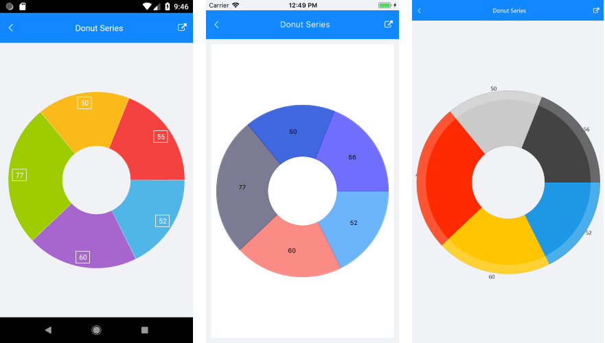

# DonutSeries #

## Overview ##

**RadPieChart** visualizes the **DonutSeries** in the shape of a donut. The inner empty space is set according to the **InnerRadiusFactor** property. Each data item is visually represented by a donut slice. The ratio between the space consumed by each slice and the space consumed by the whole chart is the same as the ratio between the value of the data point that it represents and the total value of all data points in the series.

## Features ##

- **ValueBinding**: Defines the binding to a property of the data model that will be used to fill the pie slices.
- **RadiusFactor**: Specifies the radius factor used to calculate the radius of the visual series. This value is usually within the [0,1] range but it is possible to oversize the series by setting a value greater than 1.
- **InnerRadiusFactor**: Specifies the radius factor used to calculate the radius of the inner empty space within the Donut visual element.
- **SelectedPointOffset**: Sets the offset applied to the currently selected point.

## Example ##

Here is an example that shows how to create a basic RadPieChart with DonutSeries in XAML: 

<snippet id='chart-series-donut-xaml'/>

Where:

<snippet id='xmlns-telerikchart'/>

And the business object exposes the following properties:

<snippet id='categorical-data-model'/>

You'd also need to add a ViewModel class and add some data:

<snippet id='chart-piechart-view-model'/>

Here is the result:

>important A sample Donut Series example can be found in the Chart/PieChart folder of the [SDK Samples Browser application]().

## See Also

- [Pie Series Overview]()
- [Categorical Series Overview]()

