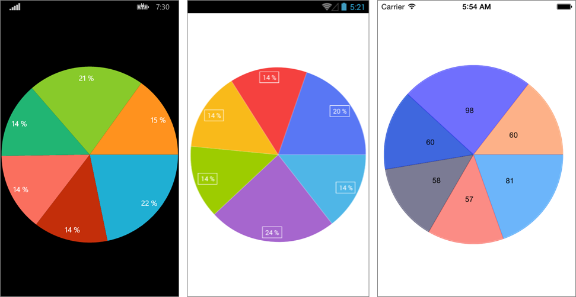

# Overview #

**RadPieChart** visualizes the **PieSeries** in the shape of a pie. Each data item is visually represented by a pie slice. The ratio between the space consumed by each slice and the space consumed by the whole chart is the same as the ratio between the value of the data point that it represents and the total value of all data points in the series.

#Features#

- **ValueBinding** : Gets or sets the binding to a property of the data model that will be used to fill the pie slices.
- **RadiusFactor** : Gets or sets the radius factor used to calculate the radius of the visual series. This value is usually within the [0,1] range but it is possible to oversize the series by setting a value greater than 1.
- **SelectedPointOffset** : Gets or sets the offset applied to the currently selected point.

# Example #

##### Here is an example of how to create a RadPieChart with PieSeries in **code**: #####

	var chart = new RadPieChart()
	{
	    BindingContext = new SimpleViewModel()
	};
	
	var series = new PieSeries();
	series.SetBinding(BarSeries.ItemsSourceProperty, new Binding("SimpleData"));    
	series.ValueBinding = new PropertyNameDataPointBinding("Value");
	series.ShowLabels = true;
	
	chart.Series.Add(series);

##### Here is an example of how to create a basic RadPieChart with PieSeries in **xaml**: #####

	<telerikChart:RadPieChart>
	  <telerikChart:RadCartesianChart.BindingContext>
	    <viewMoedls:SimpleViewModel/>
	  </telerikChart:RadCartesianChart.BindingContext>
	  <telerikChart:RadPieChart.Series>
	    <telerikChart:PieSeries ItemsSource="{Binding SimpleData}" ShowLabels="true">
	      <telerikChart:BarSeries.ValueBinding>
	        <telerikChart:PropertyNameDataPointBinding PropertyName="Value"/>
	      </telerikChart:BarSeries.ValueBinding>
	    </telerikChart:PieSeries>
	  </telerikChart:RadPieChart.Series>
	</telerikChart:RadPieChart>
Where

	xmlns:telerikChart="clr-namespace:Telerik.XamarinForms.Chart;assembly=Telerik.XamarinForms.Chart"

Here is the result:

## Customization ##

Before the RadPieChart instance is drawn, its radius needs to be calculated. By default the radius is set to such a value that the chart would fill the whole available space. Then the radius factor is applied. The default value for the radius factor is 1.0. This means that the radius will remain to a value significant to fill the entire space that is available for RadPieChart. You can use the **RadiusFactor** property in order to change it. For example, here's how to modify the radius factor, so that the pie consumes only half of the available space:

	var series = new PieSeries { RadiusFactor = 0.5 };