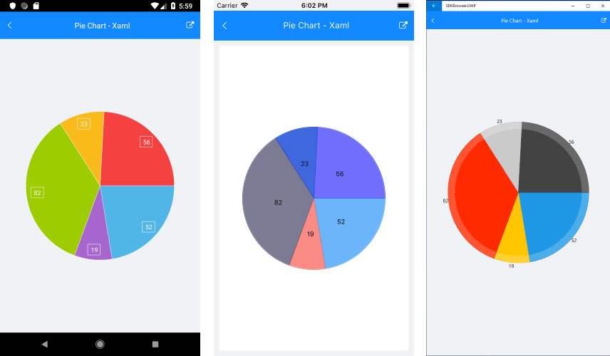

# PieSeries

## Overview

**RadPieChart** visualizes the **PieSeries** in the shape of a pie. Each data item is visually represented by a pie slice. The ratio between the space consumed by each slice and the space consumed by the whole chart is the same as the ratio between the value of the data point that it represents and the total value of all data points in the series.

## Features

- **ValueBinding**: Defines the binding to a property of the data model that will be used to fill the pie slices.
- **RadiusFactor**: Defines the radius factor used to calculate the radius of the visual series. This value is usually within the [0,1] range but it is possible to oversize the series by setting a value greater than 1.
- **SelectedPointOffset**: Defines the offset applied to the currently selected point.

## Example

Here is an example how to create RadPieChart with Pie Series:

First, create the needed business objects, for example:

<snippet id='categorical-data-model'/>

Then create a ViewModel:

<snippet id='chart-piechart-view-model'/>

Finally, use the following snippet to declare a RadPieChart with Pie Series in XAML and in C#:

<snippet id='chart-piechart-xaml'/>
<snippet id='chart-piechart-csharp'/>

In addition to this you need to add the following namespace:

<snippet id='xmlns-telerikchart'/>
<snippet id='ns-telerikchart'/>

Here is the result:

>important A sample Pie Series example can be found in the Chart/PieChart folder of the [SDK Samples Browser application]().

## See Also

- [Donut Series]()
- [Bar Series]()
- [Categorical Series Overview]()

