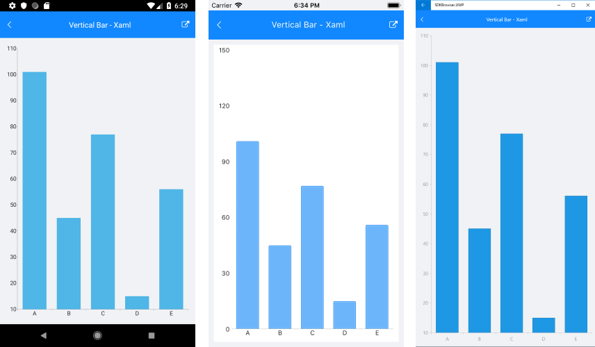

# RadCartesianChart

This chart visualizes its data points using the Cartesian coordinate system. The X and Y axes define how the coordinates of each point in the plot area are calculated and the series type defines the way these data points will be visualized.  

## Properties

The RadCartesianChart control has the following properties:

* **HorizontalAxis** (CartesianAxis): Gets or sets the visual Axis instance that will be used to plot points along the horizontal (X) axis.
* **VerticalAxis** (CartesianAxis): Gets or sets the visual Axis instance that will be used to plot points along the vertical (Y) axis.
* **Series** (ElementsCollection<CartesianSeries>): Gets a collection of all series presented by the chart instance.
* **Palette** (ChartPalette): Gets or sets the **ChartPalette** instance that defines the appearance of the chart.
* **PaletteName** (PaletteNames): Gets or sets the name of the predefined Palette that will be applied to the chart.
* **SelectionPalette** (ChartPalette): Gets or sets the **ChartPalette** instance that defines the appearance of the chart for selected series and/or data points.
* **SelectionPaletteName** (PaletteNames): Gets or sets the name of the predefined SelectionPalette that will be applied to the chart.
* **ChartBehaviors** (ObservableCollection<ChartBehavior>): Gets a collection of all enabled behaviors.
* **Grid** (CartesianChartGrid): Gets or sets the CartesianChartGrid instance used to decorate the chart plot area with grid and strip lines.
* **Annotations** (ObservableCollection<CartesianChartAnnotation>): Gets a collection of all annotations presented by the chart instance.
* **MaxZoom** (Size): Gets or sets the maximum allowed zoom.
* **Zoom**(Size zoom): Gets or sets the zoom of the chart.
* **PanOffset**(Point offset): Gets or sets an offset to the chart. Note that the offset will be specific for every platform depending on the values that the platform works with (absolute pixels or normed to the axis range) and the axis type.

## Supported Axes

**RadCartesianChart** needs to have two axes which will be used to calculate correctly the position of each data point. Usually one of the axes will be used to display the category of each data point and the other will represent its value. Here are the supported axes:

- [**Categorical**](): Arranges the plotted data points in categories where the key of each category is the point's value (if available) for that axis or its index within the points collection. The point's coordinate, specified by this axis is discrete and is calculated depending on the size of the category slot where the point resides.
- [**Numerical**](): Calculates the coordinate of each data point, depending on the actual numerical value this point provides for the axis. A NumericalAxis exposes Minimum and Maximum properties to allow for explicit definition of the range of values visible on this axis. If these properties are not specified, the axis will automatically calculate the range, depending on the minimum and maximum data point values.
- [**Date-Time Continuous**](): This is a special axis that expects each data point to provide a DateTime structure as its value for this axis. You can think of DateTimeContinuousAxis as a timeline where the coordinate of each data point is calculated depending on the position of its associated DateTime on the timeline. The base unit (or the timeline step) of the axis is calculated depending on the smallest difference between any two dates.

## Supported Series

The following Cartesian series are available:

- **Categorical**: Categorical series need a [**Numerical**]() and a [**Categorical**]()/[**Date-Time Continuous**]() axis in order to get properly plotted.
    - [**Bar**](): Data points are represented by a box where the height (width) of the box is the distance between the point’s numerical value and the categorical axis that plots the point. Bars may be either "horizontal" or "vertical" depending on whether the categorical axis is specified as an "X-axis" or as a "Y-axis".
    - [**Line**](): Data points are connected with straight line segments.
    - [**Spline**](): Data points are connected with smooth line segments.
    - [**Area**](): Data points and the corresponding coordinate axis enclose an area that may be optionally stroked and/or filled.
    - [**SplineArea**](): An area, where points are connected with smooth rather than straight segments.

Each of the above series of the same type may be combined in either [stacks or clusters](). Combinations are formed when more than one data point from different series fall within the same category. The "Cluster" combine mode will position such points next to each other while the "Stack" combine mode will arrange such points in a stack-like structure. When stacks are formed, the numerical axis (if present) will consider each stack as a single entity and its sum will be the actual value used rather than each point’s one.

- **Scatter**: Scatter series need two Numerical axes in order to get properly plotted. Scatted data provides both the X and the Y coordinate.
	- [**ScatterPoint**](): Data points are represented by an arbitrary template.
    - [**ScatterLine**](): Data points are connected with straight line segments.
    - [**ScatterSpline**](): Data points are connected with smooth line segments.
    - [**ScatterArea**](): Data points and the horizontal axis enclose an area that may be optionally stroked and/or filled.
    - [**ScatterSplineArea**](): A ScatterArea, where points are connected with smooth rather than straight segments.
	
- **Financial**: Financial series need a [**Numerical**]() and a [**Date-Time Continuous**]()/[**Categorical**]() axis in order to get properly plotted.
	- [**Ohlc**](): Each data point is visualized as a line with open and close value indicators on its side.
	- [**Candlestick**](): Data points are plotted as visuals that resemble candlesticks.
	- [**Financial Indicators**](): The financial, or also called stock indicators, are mainly used for keeping track of stock prices and patterns of price changes over time. 

## Example

1. Define RadCartesianChart:
  
```XAML
<telerikChart:RadCartesianChart>
</telerikChart:RadCartesianChart>
```
```C#
var chart = new RadCartesianChart();
```

2. The RadCartesianChart control needs two axes - horizontal and vertical to plot its data.

```XAML
<telerikChart:RadCartesianChart.HorizontalAxis>
	<telerikChart:CategoricalAxis/>
</telerikChart:RadCartesianChart.HorizontalAxis>
<telerikChart:RadCartesianChart.VerticalAxis>
	<telerikChart:NumericalAxis/>
</telerikChart:RadCartesianChart.VerticalAxis>
```
```C#
chart.HorizontalAxis = new CategoricalAxis();
chart.VerticalAxis = new NumericalAxis();
```

3. After that you can add the series to the RadCartesianChart.Series collection:

```XAML
<telerikChart:RadCartesianChart>
	<telerikChart:RadCartesianChart.Series>
		<telerikChart:BarSeries ItemsSource="{Binding CategoricalData}">
			<telerikChart:BarSeries.ValueBinding>
				<telerikChart:PropertyNameDataPointBinding PropertyName="Value"/>
			</telerikChart:BarSeries.ValueBinding>
			<telerikChart:BarSeries.CategoryBinding>
				<telerikChart:PropertyNameDataPointBinding PropertyName="Category"/>
			</telerikChart:BarSeries.CategoryBinding>
		</telerikChart:BarSeries>
	</telerikChart:RadCartesianChart.Series>
</telerikChart:RadCartesianChart>
```
```C#	
var series = new BarSeries();
series.SetBinding(BarSeries.ItemsSourceProperty, new Binding("CategoricalData"));
series.ValueBinding = new PropertyNameDataPointBinding("Value");
series.CategoryBinding = new PropertyNameDataPointBinding("Category");            
chart.Series.Add(series);
```

4. You also have to set a BindingContext of the chart if none of its parents have a context:
 
```XAML
<telerikChart:RadCartesianChart.BindingContext>
	<local:ViewModel/>
</telerikChart:RadCartesianChart.BindingContext>
```
```C#
chart.BindingContext = new ViewModel();
```

Where `local` is

```XAML
xmlns:local="clr-namespace:[The namespace where the ViewModel class is defined];assembly=[The assembly name]"
```

### CartesianChart Example

Here is the full definition of the chart:

First, create the needed business object, for example:

<snippet id='categorical-data-model'/>

Then create a ViewModel:

<snippet id='chart-series-categorical-data-view-model'/>

Finally use the following snippet to declare a RadPieChart with Pie Series in XAML and in C#:

<snippet id='chart-series-barvertical-xaml'/>
<snippet id='chart-series-barvertical-csharp'/>

Here is the final result:



>important [SDK Browser application]() contains various examples with RadCartesianChart control.

## See Also

- [Pie Chart]()
- [Chart Legend]()
- [Chart Null Values]()
