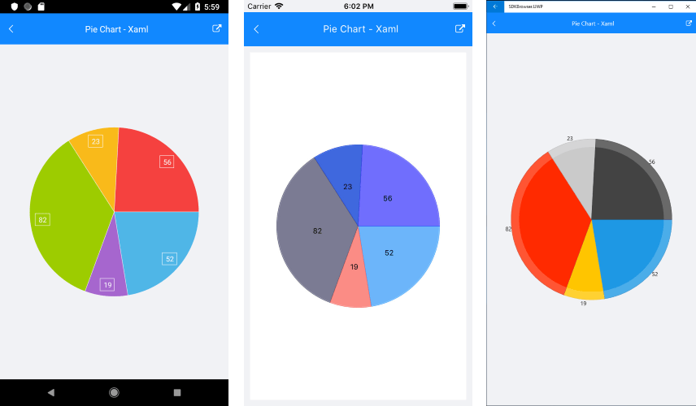

# RadPieChart #

The **RadPieChart**  visualizes its data points using radial coordinate system. Each data point is represented as a slice from a pie. The ratio between the space consumed by each slice and the space consumed by the whole chart is the same as the ratio between the value of the data point that it represents and the total value of all data points in the series.

## Properties

* **Series**: Gets a collection of all series presented by the chart instance.
* **Behaviors**: Gets a collection of all enabled behaviors.
* **Palette**: Gets or sets the **ChartPalette** instance that defines the appearance of the chart.
* **PaletteName**: Gets or sets the name of the predefined Palette that will be applied to the chart.
* **SelectionPalette**: Gets or sets the **ChartPalette** instance that defines the appearance of the chart for selected series and/or data points.
* **SelectionPaletteName**: Gets or sets the name of the predefined SelectionPalette that will be applied to the chart.

## Supported Series ##

**RadPieChart** can visualize the following types of series:

- **PieSeries**: The PieSeries are used to visualize a single series of data in a pie chart. The sweep of a pie's slices is directly proportional to the magnitude of the data points' values.

## Example ##

1. Define RadPieChart:  
	
```XAML
<telerikChart:RadPieChart>
</telerikChart:RadPieChart>
```
```C#
var chart = new RadPieChart();
```

2. After that you can add the series to the RadPieChart.Series collection:

```XAML
<telerikChart:RadPieChart.Series>
	<telerikChart:PieSeries ItemsSource="{Binding Data}">
		<telerikChart:PieSeries.ValueBinding>
			<telerikChart:PropertyNameDataPointBinding PropertyName="Value"/>
		</telerikChart:PieSeries.ValueBinding>
	</telerikChart:PieSeries>
</telerikChart:RadPieChart.Series>
```
```C#
var series = new PieSeries();
series.SetBinding(PieSeries.ItemsSourceProperty, new Binding("Data"));
series.ValueBinding = new PropertyNameDataPointBinding("Value");
chart.Series.Add(series);
```

3. You also have to set a BindingContext of the chart if none of its parents have a context:
 
```XAML
<telerikChart:RadPieChart.BindingContext>
	<local:ViewModel/>
</telerikChart:RadPieChart.BindingContext>
```
```C#
chart.BindingContext = new ViewModel();
```

### PieChart Example

Here is the full definition of the chart:

First, create the needed business object, for example:

<snippet id='categorical-data-model'/>

Then create a ViewModel:

<snippet id='chart-piechart-view-model'/>

Finally use the following snippet to declare a RadPieChart with Pie Series in XAML and in C#:

<snippet id='chart-piechart-xaml'/>
<snippet id='chart-piechart-csharp'/>

Here is the result:



>important [SDK Browser application]() contains various examples with RadPieChart control.

## See Also

- [Cartesian Chart]()
- [Chart Legend]()
- [Chart Null Values]()
