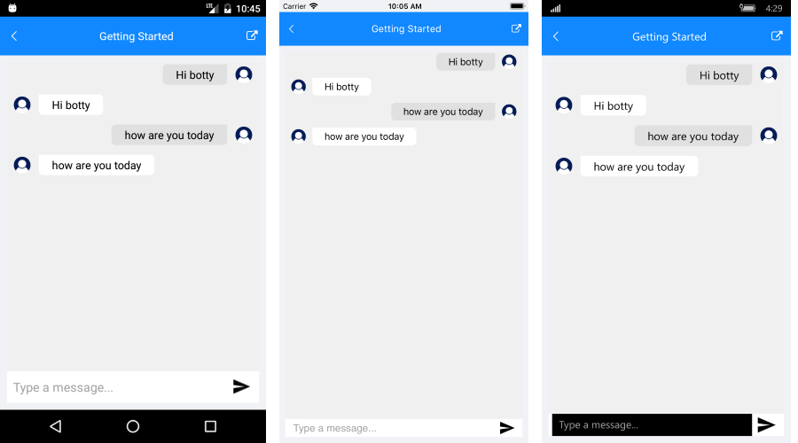

# Getting Started

This article will guide you through the steps needed to add a **RadChat** control in your application.

* [Setting up the app](#1-setting-up-the-app)
* [Adding the required Telerik references](#2-adding-the-required-telerik-references)
* [Adding RadChat control](#3-adding-radchat-control)

## 1. Setting up the app

Take a look at these articles and follow the instructions to setup your app:

- [Setup app with Telerik UI for Xamarin on Windows]()
- [Setup app with Telerik UI for Xamarin on Mac]()

## 2. Adding the required Telerik references

You have two options:

* Add the Telerik UI for Xamarin Nuget package following the instructions in [Telerik NuGet package server]() topic. Note that RadChat control does not have a separate nuget package. 

* Add the references to Telerik assemblies manually, check the list below with the required assemblies for **RadChat** component:

| Platform | Assemblies |
| -------- | ---------- |
| Portable | Telerik.XamarinForms.Common.dll   Telerik.XamarinForms.ConversationalUI.dll   Telerik.XamarinForms.DataControls.dll   Telerik.XamarinForms.Input.dll   Telerik.XamarinForms.Primitives.dll |
| Android  | Telerik.Xamarin.Android.Common.dll   Telerik.Xamarin.Android.Data.dll   Telerik.Xamarin.Android.Input.dll   Telerik.Xamarin.Android.List.dll   Telerik.Xamarin.Android.Primitives.dll   Telerik.XamarinForms.Common.dll   Telerik.XamarinForms.ConversationalUI.dll   Telerik.XamarinForms.DataControls.dll   Telerik.XamarinForms.Input.dll   Telerik.XamarinForms.Primitives.dll |
| iOS      | Telerik.Xamarin.iOS.dll    Telerik.XamarinForms.Common.dll   Telerik.XamarinForms.ConversationalUI.dll   Telerik.XamarinForms.DataControls.dll   Telerik.XamarinForms.Input.dll   Telerik.XamarinForms.Primitives.dll |
| UWP      | Telerik.Core.dll   Telerik.Data.dll   Telerik.UI.Xaml.Controls.Data.UWP.dll   Telerik.UI.Xaml.Input.UWP.dll   Telerik.UI.Xaml.Primitives.UWP.dll   Telerik.XamarinForms.Common.dll   Telerik.XamarinForms.ConversationalUI.dll   Telerik.XamarinForms.DataControls.dll   Telerik.XamarinForms.Input.dll   Telerik.XamarinForms.Primitives.dll |

## 3. Adding RadChat control

You could use one of the following approaches:

#### Drag the control from the Toolbox. 

Take a look at the following topics on how to use the toolbox:

* [Telerik UI for Xamarin Toolbox on Windows]()
* [Telerik UI for Xamarin Toolbox on Mac]()

#### Create the control definition in XAML or C#.

The snippet below shows a simple RadChat definition:

<snippet id='chat-gettingstarted'/>

In addition to this you need to add the following namespace:

<snippet id='xmlns-telerikchat'/>

So, for a simple demonstration purpose a sample echo bot will be defined.

<snippet id='chat-gettingstarted-botservice' />

Then, initialize the RepeatBotService and subscribe to the CollectionChanged event of the Items collection of the Chat instance:

<snippet id='chat-getting-started-initiliaze' />
	
Finally, add the needed event handlers:

<snippet id='chat-getting-started-events' />
	
#### Figure 1: RadChat Getting Started

	
>important **SDK Browser** and **QSF** applications contain different examples that show RadChat's main features. You can find the applications in the **Examples** and **QSF** folders of your local **Telerik UI for Xamarin** installation.

## See Also

- [Key Features]()