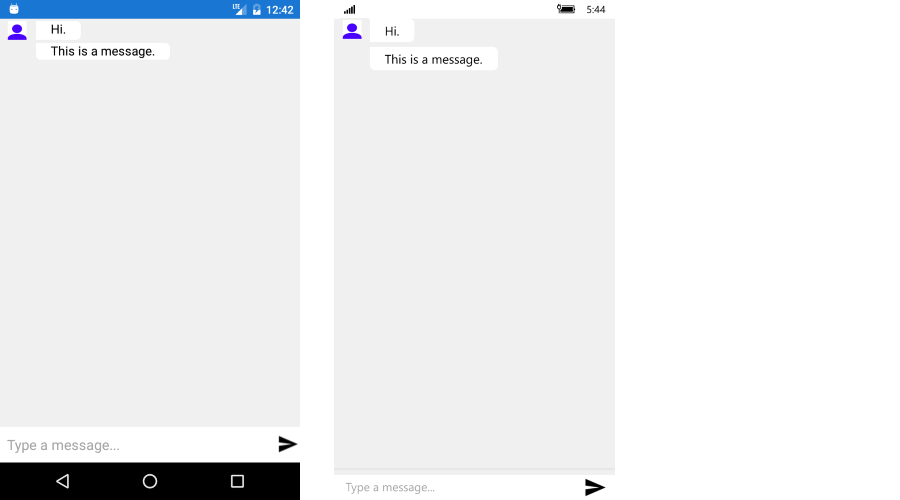

# Messages #

**ChatMessage** is the basic message unit in RadChat. It contains information about the Author of the message as well as any additional data regarding the message.  

The Author property is of type Telerik.XamarinForms.ConversationalUI.Author and exposes the following properties:

* Name – author name;
* Avatar – image related to the author, displayed in the Chat UI;
* Data - you could use it to preserve additional information about the author;

By default, when the end user types in the textbox and confirms the message, it is set to the to RadChat's Message property. In addition, the SendMessage event is fired each time a new message is about to be added to the chat UI. It is allowed to modify the message itself.

## TextMessage

The **TextMessage** is intended to be used for sending a simple string type message. It derives from ChatMessage and provides an additional Text property which holds the string message. 

#### Adding a message

You could create a sample TextMessage message like this:

#### C#
	var me = new Author() { Name = "human", Avatar = "SampleAvatar.png" };
    chat1.Items.Add(new TextMessage { Author = me, Text = "Hi." });
    chat1.Items.Add(new TextMessage { Author = me, Text = "This is a message." });

And here is the result:

## See Also

- [Getting Started]()