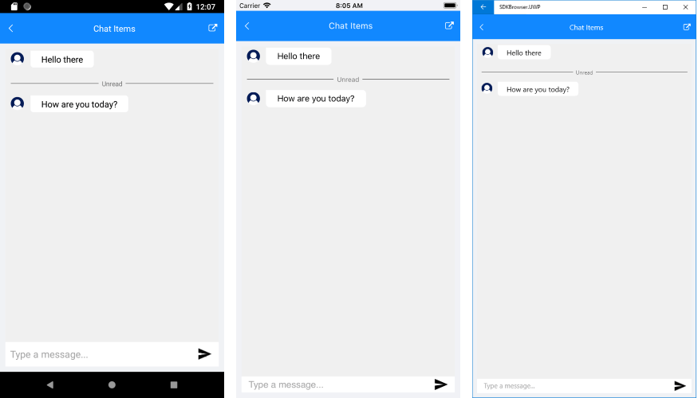

# Time Break #

**TimeBreak** item of RadChat is intended to encapsulate a group of messages according to a certain condition, such as given time intervals or read/unread messages. It is visualized as a dividing line across the messages board with a text message attached to it. 

TimeBreak derives from ChatItem and provides an additional **Text** property which holds the string message.

#### Adding a TimeBreak

You could create a sample TimeBreak item like this:

<snippet id='chat-chatitems-timebreak' />

And here is the result:

## See Also

- [Key Features]()
- [Messages]()