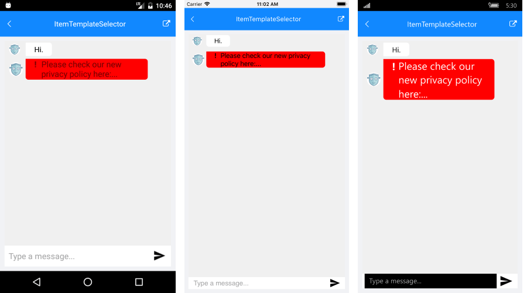

# ItemTemplateSelector #

RadChat control exposes an ItemTemplateSelector property which you can use to apply different templates to each chat item depending on a specific condition.  

Any change on the appearance of the chat items depends on the ChatItemTemplateSelector and the containing templates and referenced Styles. The default selector includes separate templates for the incoming and outgoing messages, as well as for the first, middle and last messages - this is needed in order to achieve the "balloon" look & feel of the messages.

You can also create a custom ChatItemTemplateSelector to conditionally apply different messages styles depending on any of the used chat item properties.  

Let's, for example, have the following ChatItem class with a custom MessageCategory property to distinguish important messages:

<snippet id='chat-features-itemtemplate-chatitem' />

Add a few sample Items to the Chat's ItemsSource:

<snippet id='chat-features-itemtemplate-items' />

> You would need to supply an ItemsConverter as you're using custom items as demonstrated inside MVVM Support topic.

<snippet id='chat-features-itemtemplate-itemconverter' />

Create a CustomChatItemTemplateSelector class that derives from the ChatItemTemplateSelector:

<snippet id='chat-features-itemtemplate-templateselector' />
	
Create the needed XAML resources:

<snippet id='chat-features-itemtemplate-resources' />

Set it to the Chat's ItemTemplateSelector property:

<snippet id='chat-features-itemtemplate-xaml' />

and add the **telerikPrimitives** namespace:

<snippet id='xmlns-telerikprimitives' />

#### Figure 1: RadChat with ItemTemplateSelector

	
## See Also

- [Key Features]()
- [MVVM Support]()
- [Commands] ()
