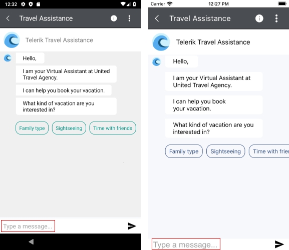

# Localization #

Conversational UI for Xamarin provides language localization. In short, you can translate the used across the Chat control phrases to other languages, so that your app can be adapted to different regions.

>important To learn in details about the localization process of Telerik UI for Xamarin components, please go through the common [Localization and Globalization]() topic.

In RadChat you can localize the following string:

| Localization Key | Default Value |
| -----------------| ------------- |
| ConversationalUI_EntryWatermark | Type a message... | 

The localization key refers to the watermark message that is shown in the input field of the Chat as shown in the image below:

	
## See Also

- [Chat Items]() 
- [ChatPicker]()
- [MVVM Support]()
- [ItemTemplateSelector] ()