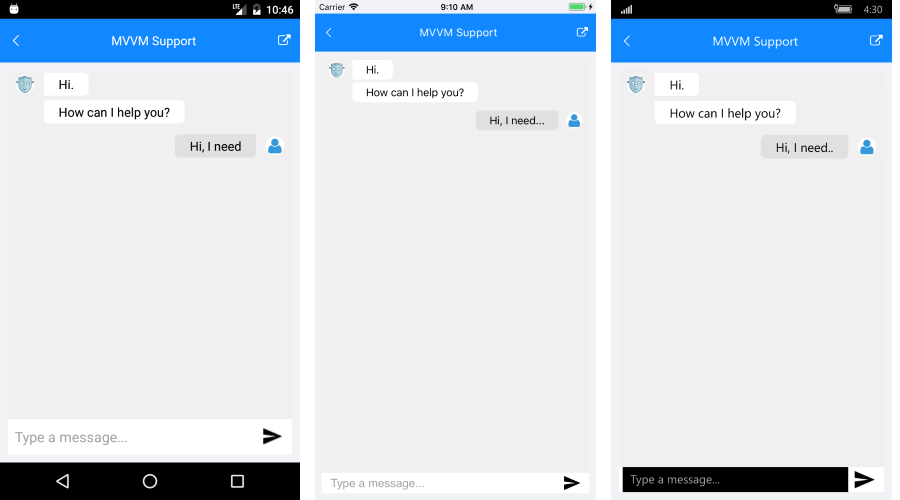

# MVVM Support #

With **RadChat** control you could easily utilize the Model-View-ViewModel (MVVM) pattern. This could be achieved through the **ItemsSource** property that can be bound/set to a collection of any data items that should be then converted into chat items.

This help article will demonstrate how to use RadChat in MVVM scenarios.

First, create a sample class used to hold the needed information for the chat items:

<snippet id='chat-features-mvvm-chatitem'/>

Create a ViewModel containing a collection of your SimpleChatItem items. You could also bind the Chat's Author property that represents the end user typing in the input field.

<snippet id='chat-features-mvvm-viewmodel'/>

The next step is to create a Converter class of type IChatItemConverter in order to convert the data items into chat messages and vice versa:

<snippet id='chat-features-mvvm-converter'/>

And finally, all that is left is to add the RadChat control to your page with previously defined ItemsSource and ItemConverter properties:

<snippet id='chat-features-mvvm-xaml' />
	
#### Figure 1: RadChat in MVVM setup

	
## See Also

- [Key Features]()
- [Commands]()
- [ItemTemplateSelector] ()