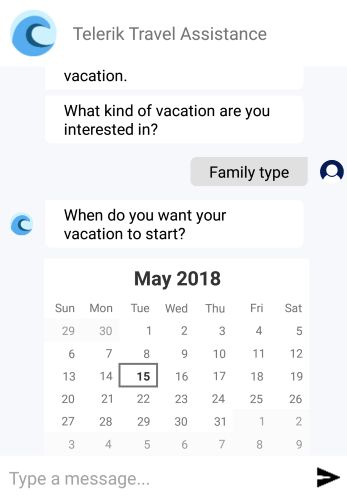

# Overview #

**Telerik RadChat for Xamarin** (available since R2 2018) is a UI component that enables easy implementation of conversational UI in Xamarin applications, whether by utilizing certain chatbot framework, by following a predefined logical tree, or just for integrating P2P chat capabilities. 

#### Figure 1: RadChat Overview

## Key features

* **A variety of chat items for better user experience**: You could choose between simple text messages, various picker items and cards. 
* **Highly customizable message and card content**: You have full control over the visual appearance of the chat items;
* **Integration with conversational UI APIs**: RadChat control can be used with all the major conversational UI APIs or services such as Microsoft Bot, Google’s API.AI, Amazon LEX, and more.
* **Theming Support**: RadChat comes with built-in theming support that helps you achieve consistent look with the rest controls from Telerik UI for Xamarin suite.

## See Also

- [Getting Started]()