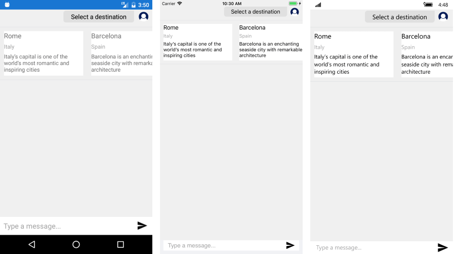

# CardPicker Overview #

RadChatPicker control provides **CardPickerContext** that can be used to display a list of cards. Each card presents more complex information in a user-friendly structured manner and allows the user to interact with it. 

**CardPickerContext**  exposes the following property:

* Cards - it is of type IEnumerable&lt;CardContext&gt; and contains the available Cards defined by the CardContext;

Depending on the information that is presented, the **CardContext** can be one of the following types:

* BasicCardContext - for displaying a card with Title, SubTitle and Descrption;
* ImageCardContext - derives from BasicCardContext with an additional Image property;

Here is a quick example with BasicCardContext:

<snippet id='chat-chatpicker-cardpicker-pickeritem' />

And the used GetCards() method:

```C#
private IEnumerable<CardContext> GetCards(ChatItem chatItem)
{
	List<CardContext> cards = new List<CardContext>()
	{
		new BasicCardContext() {Title="Rome", Subtitle="Italy", Description="Italy’s capital is one of the world’s most romantic and inspiring cities"},
		new BasicCardContext() {Title="Barcelona", Subtitle="Spain", Description="Barcelona is an enchanting seaside city with remarkable architecture"}
	};
	return cards;
}
```
	
#### Figure 1: RadChat with BasicCard


	
#### Cards Actions

Each card allows you to add a certain action that can be handled through a command. The **CardContext** exposes an **Actions** collection of type IEnumerable&lt;CardActionContext&gt; that supplies all the details needed for handling the action.

**CardActionContext** provides the following properties:

* Text - represents the action inside the Card layout;
* Command - the command that is raised when the user selects that action;
* Data - can be used to preserve additional details if needed;

The next snippet uses the Cards defined in the previous example and add Actions to them.

<snippet id='chat-chatpicker-cardpicker-getcards' />

#### Figure 2: RadChat with BasicCard with Actions


## See Also

- [ChatPicker]()
- [ImageCard]()