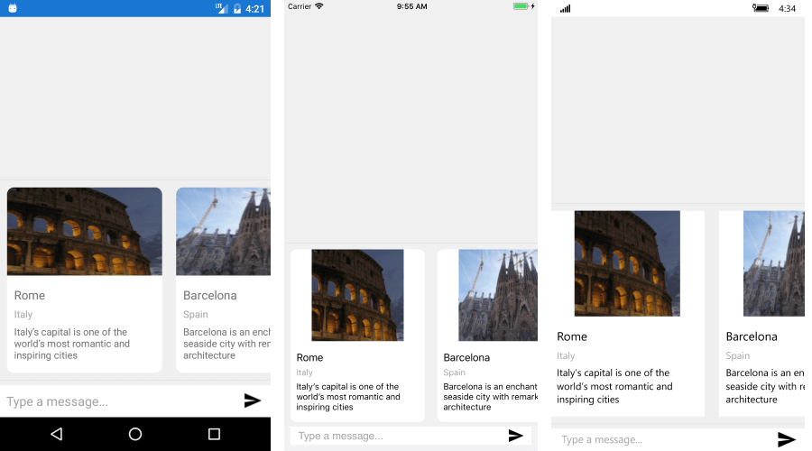

# ImageCard #

**ImageCardContext** enhances the functionality of the BasicCardContext by providing an additional Image property, so you could add an image to the Card definition. 

Here is a quick example on how to create a sequence of ImageCards and show it through the RadChat Picker's control.

```C#
var cardsContext = new CardPickerContext {
Cards = new List<CardContext>()
{
	new ImageCardContext() {
		Title ="Rome",
		Subtitle ="Italy",
		Description ="Italy’s capital is one of the world’s most romantic and inspiring cities",
		Image = "RomeCard.png"
	},
	new ImageCardContext() {
		Title ="Barcelona",
		Subtitle ="Spain",
		Description ="Barcelona is an enchanting seaside city with remarkable architecture",
		Image = "BarcelonaCard.png"
	}}
};
(chat.Picker as RadChatPicker).Context = cardsContext;
```
	
#### Figure 1: RadChat with ImageCard


	
## See Also

- [ChatPicker]()
- [BasicCard] ()