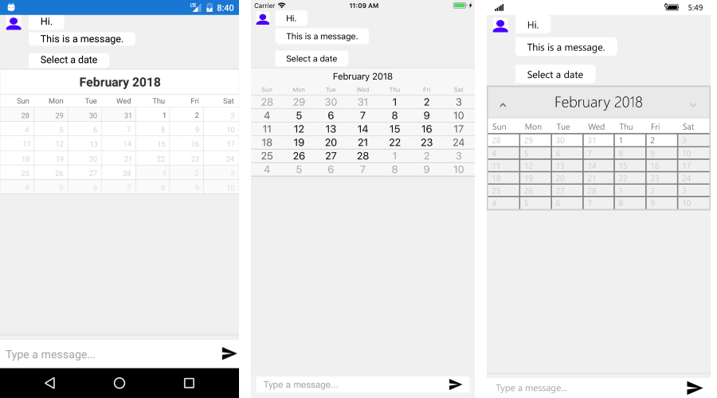

# DatePicker #

RadChatPicker control provides **DatePickerContext** that can be used to display a Calendar to choose a date.

**DatePickerContext** exposes the following properties you could use to provide a list of possible options to the user:

* SelectedDate - defines the currently selected date;
* MinDate - defines the min date that can be displayed and selected;
* MaxDate - defines the max date that can be displayed and selected;
* DisplayDate - defines a date in the current view;

Here is a quick example on how to user DatePicker:

	DatePickerContext context = new DatePickerContext { MinDate = new DateTime(2018, 1, 1), MaxDate = new DateTime(2018, 2, 2) };
    PickerItem pickerItem = new PickerItem { Context = context };
    chat1.Items.Add(new TextMessage { Text = "Select a date" });
    chat1.Items.Add(pickerItem);
    context.PropertyChanged += (s, e) =>
	{
		if (e.PropertyName == "SelectedDate")
		{
			if (context.SelectedDate != null)
			{
				chat1.Items.Remove(pickerItem);
				chat1.Items.Add(new TextMessage { Author = chat1.Author, Text = "" + context.SelectedDate });
			}
		}
	};
	
And here is the result:

## See Also

- [Getting Started]()