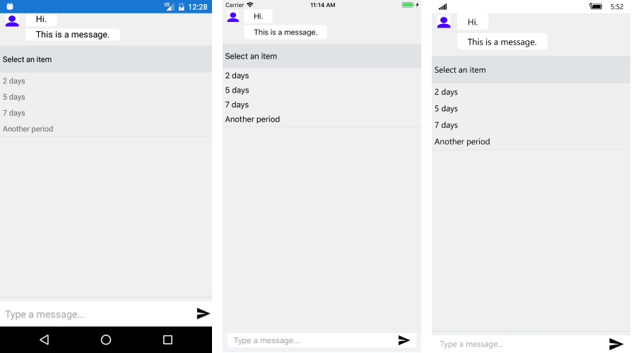

# ItemPicker #

RadChatPicker control provides **ItemPickerContext** that can be used to display a list of options the end user could choose from.

**ItemPickerContext** exposes the following properties you could use to provide a list of possible options to the user:

* ItemsSource - defines the data source used to generate the content of the ItemPicker control;
* SelectionMode - ItemPicker allows users to select one or many items out of the provides ItemsSource;
* SelectedItems - defines the currently selected items;
* SelectedItem - defines the last selected item;

Here is a quick example on how to user ItemPicker:

	ItemPickerContext context = new ItemPickerContext {
		ItemsSource = new List<string>() { "2 days", "5 days", "7 days", "Another period" }};
	PickerItem pickerItem = new PickerItem { Context = context, HeaderText = "Select an item" };

	chat.Items.Add(pickerItem);
	context.PropertyChanged += (s, e) =>
	{
		if (e.PropertyName == "SelectedItem")
		{
			if (context.SelectedItem != null)
			{
				chat.Items.Remove(pickerItem);
				chat.Items.Add(new TextMessage { Author = chat.Author, Text = "" + context.SelectedItem});
			}
		}
	};
	
#### Figure 1: Chat with ItemPicker

## See Also

- [ChatPicker]()
- [DatePicker]()
- [TimePicker]()
- [CardPicker]()