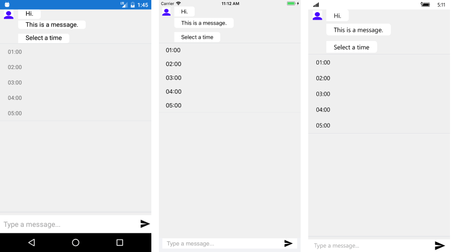

# TimePicker #

RadChatPicker control provides **TimePickerContext** that can be used to display a clock view to choose a time.

**TimePickerContext** exposes the following properties you could use to adjust the clock items:

* SelectedValue - defines the currently selected time;
* StartTime -  it is of type TimeSpan and represents the starting time of the clock's items.
* EndTime -  it is of type TimeSpan and corresponds to the time of the last clock item.
* TimeInterval - it is also of type TimeSpan and defines the step between the clock's items. Default value is 1 hour.

Here is a quick example on how to user TimePicker in RadChat:

<snippet id='chat-chatpicker-timepicker' />
	
#### Figure 1: Chat with TimePicker

## See Also

- [ChatPicker]()
- [TimePicker]()
- [ItemPicker]()
- [CardPicker]()