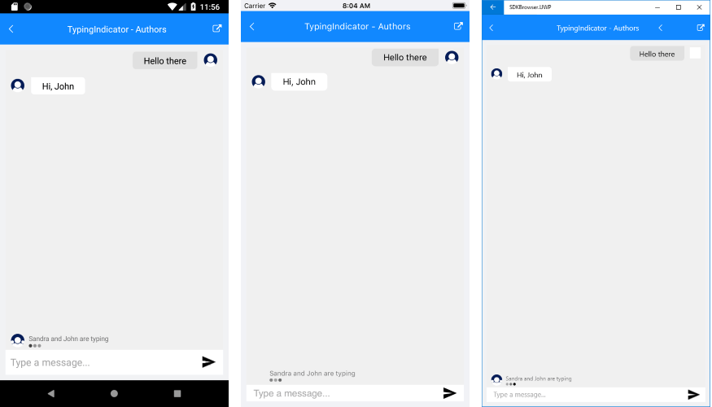

# Typing Indicator #

The **TypingIndicator** functionality of Conversational UI can be used to indicate that a participant (or participants) is currently typing. 

By default, the TypingIndicator is not visible. As soon as its Authors (or ItemsSource) collection is updated, it is displayed with a text message indicating the authors’ names. 

The text message is built according to the count of authors like this:

* If the collection of Authors contains 1 item: “[Author name] is typing”;
* If there are two authors: “[Author1 name] and [Author2 name] are typing”;
* In case of three authors: “[Author1 name], [Author2 name] and [Author3 name] are typing”;
* In case of more authors: [Author1 name], [Author2 name] and 2 others are typing”;

When the Authors (or ItemsSource) collection is cleared, the TypingIndicator is hidden.

In addition, by setting **Text** property the text message could be replaced with any other of your choice.

#### Adding a TypingIndicator

In order to add a typing indicator just set TypingIndicator property of RadChat control:

<snippet id='chat-typingindicator-xaml' />
	
There are two ways to display the typing indicator:

#### Using Authors collection:

You can use directly **Authors** collection which is of type *ObservableCollection<Author>* to show the participants who are currently typing. Here is a quick example:

<snippet id='chat-typingindicator-authors-code' />

And the result is:

#### Using ItemsSource collection:

If you prefer the MVVM pattern, you can use **ItemsSource** property of the TypingIndicator  - ItemsSource property could be bound/set to a collection of any data items that should be then converted into Author items. 

First, create a sample Participant class which will hold the details for the participants in the conversation:

<snippet id='chat-typingindicator-participant' />

Create a ViewModel containing a collection of your Participant items:

<snippet id='chat-typingindicator-itemssource-viewmodel' />

The next step is to create a Converter class of type *IAuthorConverter* in order to convert the data items into Authors:

<snippet id='chat-typingindicator-authorsconverter' />

And finally, all that is left is to add the RadChat control to your page with previously defined ItemsSource and ItemConverter properties of the TypingIndicator:

<snippet id='chat-typingindicator-itemssource-xaml' />

And here is result:

	
## See Also

- [Key Features]()
- [MVVM Support] ()