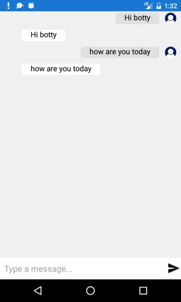

# Getting Started
   
This example will guide you through the steps needed to add a basic **RadChat** control in your application. For the purpose of the example a simple echo bot will be defined, which simply repeats the sent message.

>Before you proceed, please, take a look at these articles and follow the instructions to setup your app:

>- [Setup on Windows]()
>- [Setup on Mac]()

## Example

If your app is setup, you are ready to add a RadChat control to your page.

<snippet id='chat-gettingstarted'/>

In addition to this you need to add the following namespace:

<snippet id='xmlns-telerikchat'/>

So, for a simple demonstration purpose a sample echo bot will be defined.

<snippet id='chat-gettingstarted-botservice' />

Then, initialize the RepeatBotService and subscribe to the CollectionChanged event of the Items collection of the Chat instance:

<snippet id='chat-getting-started-initiliaze' />
	
Finally, add the needed event handlers:

<snippet id='chat-getting-started-events' />
	
#### Figure 1: RadChat Getting Started

	
>important **SDK Browser** and **QSF** applications contain different examples that show RadChat's main features. You can find the applications in the **Examples** and **QSF** folders of your local **Telerik UI for Xamarin** installation.

## See Also

- [Key Features]()