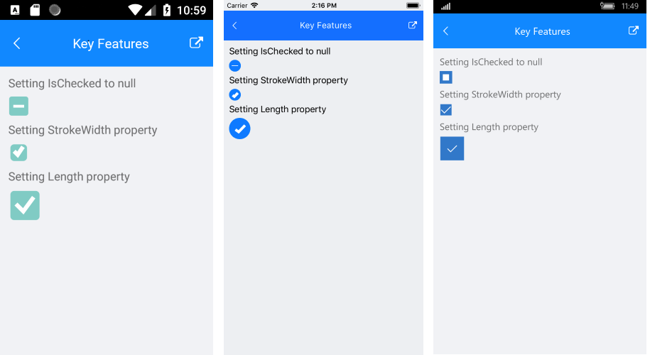

# Key Features

The purpose of this help article is to show you the key features of the **RadCheckBox** control. 

## CheckBox States

RadCheckBox provides three states – **Checked**, **Unchecked** and **Indeterminate**. The state is controlled through the **IsChecked** property which is of type bool?. **Checked** and **Unchecked** could be set either through the UI or programmatically, while **Indeterminate** could be applied only through code.

* **Checked**/**Unchecked** state - when **IsChecked** is true/false respectively;
* **Indeterminate** state - when **IsChecked** is null;
* **IsThreeState** (*bool*) - Defines whether the Indeterminate state could be set throught the UI. When set **IsThreeState** to *true* it allowes you to set the **Indeterminate** state through the UI. The default value is false.

The default value of **IsChecked** is false.

Here is an example how you can set the **Indeterminate** state throught the UI when **IsThreeState** is *true*:

<snippet id='checkbox-key-features-ischeckednull-xaml'/>

and the ViewModel:

<snippet id='checkbox-key-features-viewmodel'/>

## CheckBox Length

The width and height of the checkbox is controlled through the **Length** property and maintains a 1:1 aspect ratio. 

Here is an example of setting the `Length` value:

<snippet id='checkbox-key-features-length-xaml'/>

## Stroke Thickness

The RadCheckBox control exposes a **StrokeWidth** property that specifies the width of the lines with which the Checkbox element is drawn. It affects the border of the control as well as the check mark.

Here is an example how you can apply a `StrokeWidth` value:

<snippet id='checkbox-key-features-strokewidth-xaml'/>

### Example

Here is the result at runtime showing the above Indeterminate state as well as StrokeWidth and Length examples:

## See Also

- [CheckBox Getting Started]()
- [CheckBox Styling]() 
