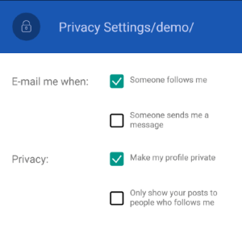

# Overview

**Telerik RadCheckBox for Xamarin** is a checkbox control which enables users to make a choice between two mutually exclusive options. The user’s selection is indicated by a check mark, and when a user clicks the checkbox its appearance and state change.  

#### Figure 1: RadCheckBox Overview

## Key features

* **Indeterminate state support**: RadCheckBox provides an additional indeterminate state which indicates the control is neither checked nor unchecked, for more details go [here](#checkbox-states).
* **Color customization**: You will be able to set various Color properties to make changes to the look of different parts of the CheckBox control, check [here](#colors) for more details.
* **Stroke Width customization**: You will have the option to customize the layout of the CheckBox, including the borders and the check mark, read more [here](#stroke-width).
* **Different sizes**: You will be able to set the dimension of the CheckBox by adjusting only one property - the Length property, check the details [here](#checkbox-length).
* **Commands support**: CheckBox exposes a Commands collection that allows you to register custom commands with each control’s instance, read more [here](#commands).
* **Theming Support**: RadCheckBox comes with built-in theming support that allows you to easily build slick interfaces with the look-and-feel of a predefined theme. See the Theme color keys [here](#theme)

## See Also

- [Getting Started]()
- [CheckBox Styling]()
