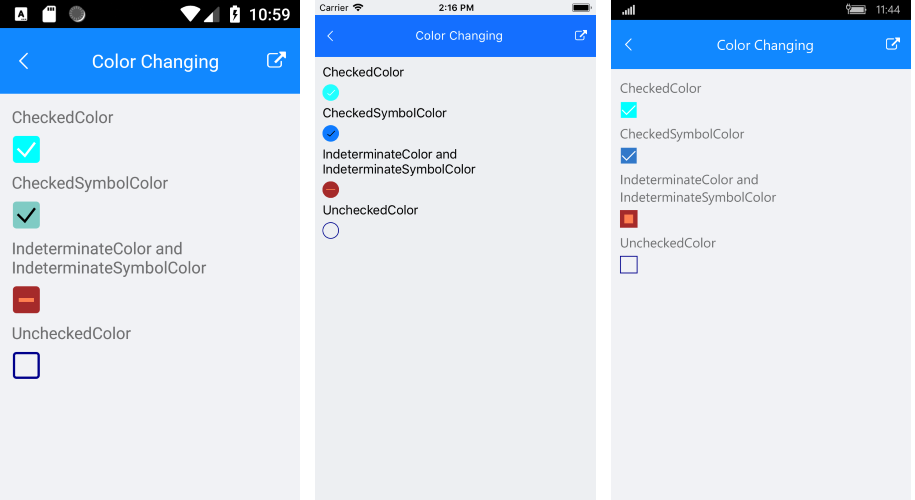

---
title: Styling
page_title: Styling
position: 3
slug: checkbox-styling
---

# Styling

The purpose of this help article is to show you the styling options of the **RadCheckBox** control. 

## CheckBox Length

The width and height of the checkbox is controlled through the **Length** property and maintains a 1:1 aspect ratio. 

Here is an example of setting the `Length` value:

<snippet id='checkbox-key-features-length-xaml'/>

## Stroke Thickness

The RadCheckBox control exposes a **StrokeWidth** property that specifies the width of the lines with which the Checkbox element is drawn. It affects the border of the control as well as the check mark.

Here is an example how you can apply a `StrokeWidth` value:

<snippet id='checkbox-key-features-strokewidth-xaml'/>

### Example

Here is the result at runtime showing the above StrokeWidth and Length examples:


## Colors

RadCheckBox exposes a few useful Color properties for customizing its visual appearance. You could set the color of the check mark as well as the control itself in each of the available states.

 * Background/Border Colors
   * **CheckedColor**: Defines the Color applied to the control when it is checked. This is both the border and background color.
   * **UncheckedColor**: Defines the Color applied to the control when it is unchecked. This is the border color only, the background is transparent when unchecked.
   * **IndeterminateColor**: Defines the Color applied to the control when it is in Indeterminate state. This is both the border and background color.
 * Symbol Colors
   * **CheckedSymbolColor**: Defines the Color applied to the check symbol of the control when it is in Checked state.
   * **IndeterminateSymbolColor**: Defines the Color applied to the Indeterminate symbol of the control.

### Example
Here is an example how to apply indeterminate color and indeterminate symbol color:

Checked Color
<snippet id='checkbox-color-changing-checkedcolor-xaml'/>

UncheckedColor
<snippet id='checkbox-color-changing-uncheckedcolor-xaml'/>

CheckedSymbol
<snippet id='checkbox-color-changing-checkedsymbolcolor-xaml'/>

Indeterminate and IndeterminateSymbol Color
<snippet id='checkbox-color-changing-inderetminatecolorsymbolcolor-xaml'/>


Here is the result at runtime with all of the above examples:




## Theme

Telerik UI for Xamarin allows you to override the default theme and provide an entire set of colors across all the controls in a custom theme. Visit the [Modifying the Default Theme]() article for more instructions.

The colors you can set in the custom theme are as follows

```xml
<!-- CheckBox -->
<Color x:Key="TelerikCheckBoxCheckedColor">#3148CA</Color>
<Color x:Key="TelerikCheckBoxCheckedSymbolColor">White</Color>
<Color x:Key="TelerikCheckBoxIndeterminateColor">#3148CA</Color>
<Color x:Key="TelerikCheckBoxIndeterminateSymbolColor">White</Color>
<Color x:Key="TelerikCheckBoxUncheckedColor">#919191</Color>
```

To use the custom theme on any RadCheckBox instance, set the `StyleClass="Telerik"`, here's an example:

```xml
<primitives:RadCheckBox StyleClass="Telerik" />
```


## See Also

- [CheckBox Getting Started]()
- [CheckBox Key Features]()
