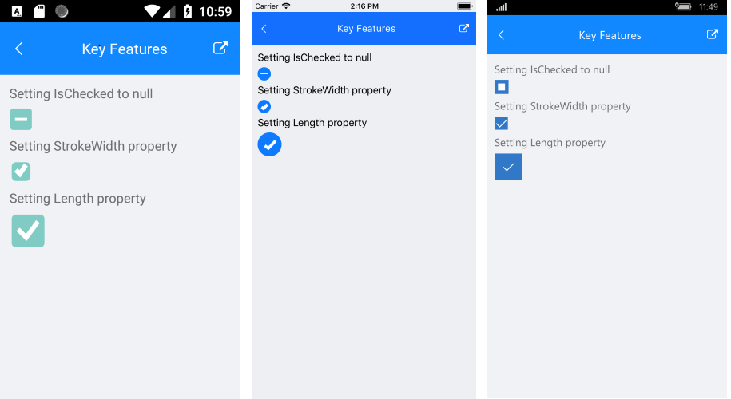

# Key Features

The purpose of this help article is to show you the key features of the **RadCheckBox** control. 

## Color Changing Options

RadCheckBox exposes a few useful Color properties for customizing its visual appearance. You could set the color of the check mark as well as the control itself in each of the available states.

 * **CheckedColor**: Defines the Color applied to the control when it is checked.
 
<snippet id='checkbox-color-changing-checkedcolor-xaml'/>

 * **CheckedSymbolColor**: Defines the Color applied to the check symbol of the control when it is in Checked state.
 
<snippet id='checkbox-color-changing-checkedsymbolcolor-xaml'/>

 * **IndeterminateColor**: Defines the Color applied to the control when it is in Indeterminate state.
 * **IndeterminateSymbolColor**: Defines the Color applied to the Indeterminate symbol of the control.

>Here is an example how to apply indeterminate color and indeterminate symbol color:

<snippet id='checkbox-color-changing-inderetminatecolorsymbolcolor-xaml'/>

 * **UncheckedColor**: Defines the Color applied to the control when it is unchecked.

<snippet id='checkbox-color-changing-uncheckedcolor-xaml'/>

Here is the end result with all color changing options:

## Stroke Width Customization

The RadCheckBox control exposes a **StrokeWidth** property that specifies the width of the lines with which the Checkbox element is drawn. It affects the outline of the control as well as the check mark.

Here is an example how you can apply a stroke width value:

<snippet id='checkbox-key-features-strokewidth-xaml'/>

## CheckBox States

RadCheckBox provides three states – **Checked**, **Unchecked** and **Indeterminate**. The state is controlled through the **IsChecked** property which is of type bool?. The state could be set either through the UI or programmatically as explained below:

* **Checked**/**Unchecked** state - when **IsChecked** is true/false respectively;
* **Indeterminate** state - when **IsChecked** is null;

The default value of **IsChecked** is false.

Here is an example how you can set the **Indeterminate** state:

<snippet id='checkbox-key-features-ischeckednull-xaml'/>

## CheckBox Size

The size of the checkbox is controlled through the **Length** property, this snippet shows how you can apply it.

<snippet id='checkbox-key-features-length-xaml'/>

## Commands

RadCheckBox exposes a Commands collection that allows you to register custom commands with each control’s instance through the **Commands** property:

* **Commands**: Gets the collection with all the custom commands registered with the CommandService.

### Command Type

There are two types of commands:

* **CheckBoxCommand**: All the default commands within RadCheckBox derive from the base RadCheckBoxCommand. Think of this command as a UI-related command as it operates over the RadCheckBox instance that owns the command.
* **CheckBoxUserCommand**: This type of command should be used when you would like to modify the behavior of the control on any of the available actions. It exposes the following properties:
	* **Id**: The key that relates a command instance to a particular action/routine.
	* **Command**: Gets or sets the generic **ICommand** implementation.
	* **SuppressDefaultCommand**: Gets or sets a value indicating whether the default(built-in) UI command associated with the specified **Id** will be executed.

Here is the end result with stroke width, size and state customization:

## See Also

- [CheckBox Getting Started]()
