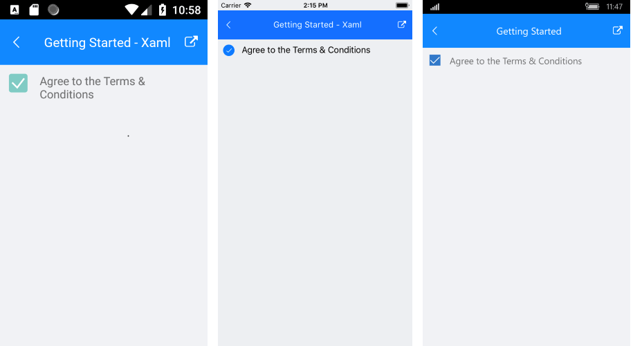

# Getting Started
   
This example will guide you through the steps needed to add a basic **RadCheckBox** control in your application.

>Before you proceed, please, take a look at these articles and follow the instructions to setup your app:
>
>- [Setup on Windows]()
>- [Setup on Mac]()

## Example

If your app is correctly set, you are ready to add a **RadCheckBox** control to the page:

<snippet id='checkbox-getting-started-xaml'/>

In addition to this, you need to add the following namespace:

<snippet id='xmlns-telerikprimitives'/>
<snippet id='ns-telerikprimitives'/>

Here is the result:

>important **SDK Browser** and **QSF** applications contain different examples that show RadCheckBox's main features. You can find the applications in the **Examples** and **QSF** folders of your local **Telerik UI for Xamarin** installation.

## See Also

- [Key Features]()