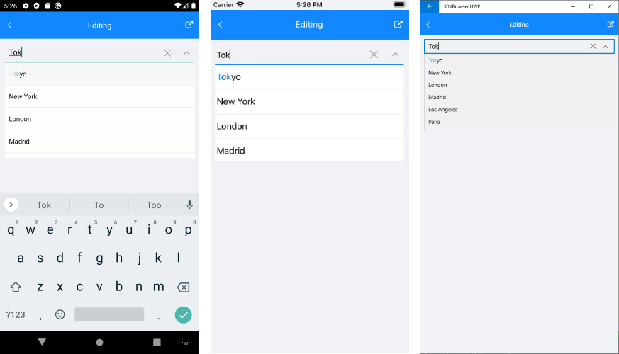

# Editing

ComboBox supports both **editable** and **noneditable** state. When the control is in edit mode searching can be performed. 

- **IsEditable**(*bool*): Defines whether editing can be performed. The default value is `false`.
- **SearchTextPath** (*string*): Defines the name of the property against which the searching will be performed. The property is usable when editing is performed. 

In addition, when IsEditable is set to true, the drop-down list is opening when the control is focused. That behavior could be changed using the OpenOnFocus property (bool) that is true by default. If the property is set to false when the control is focused the drop-down will no longer open.

- **Text**(*string*): Specifies the Text of the control. This is the Text that gets visualized when the control is editable or when it is non-editable and the selection mode is single.

## Example

Here is the ComboBox definition in XAML:

<snippet id='combobox-editing'/>

>note When binding to a complex objects, ComboBox **DisplayMemberPath** property should be set. Also when `IsEditable` is `true` `SearchTextPath` property should be set.

In addition to this, you need to add the following namespace:

<snippet id='xmlns-telerikinput'/>

the sample business model

<snippet id='combobox-city-businessmodel'/>

and the ViewModel used:

<snippet id='comobobox-editing-viewmodel'/> 

Herre is how the control looks in edit mode:

## See Also

- [Key Features]()
- [Searching]()
- [Single and Multiple Selection]()
- [Templates]()
