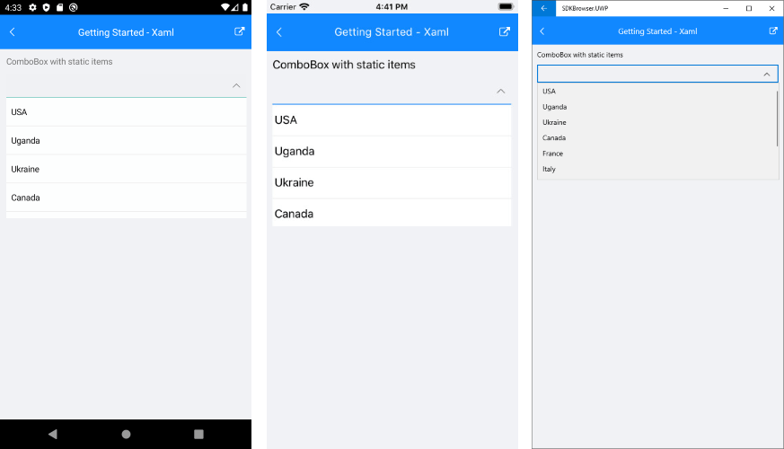

# Getting Started with ComboBox for Xamarin
   
This article will guide you through the steps needed to add a basic **RadComboBox** control in your application.

* [Setting up the app](#1-setting-up-the-app)
* [Adding the required Telerik references](#2-adding-the-required-telerik-references)
* [Adding RadComboBox control](#3-adding-radcombobox-control)
* [Populating RadComboBox control with data](#4-populating-radcombobox-control-with-data)

## 1. Setting up the app

Take a look at these articles and follow the instructions to setup your app:

- [Setup app with Telerik UI for Xamarin on Windows]()
- [Setup app with Telerik UI for Xamarin on Mac]()

## 2. Adding the required Telerik references

You have two options:

* Add the Telerik UI for Xamarin Nuget package following the instructions in [Telerik NuGet package server]() topic.

If you don't want to add the all Telerik.UI.for.Xamarin nuget package, you have the option to add a separate nuget package. For RadComboBox control you have to install the **Telerik.UI.for.Xamarin.Input** nuget package. This nuget will automatically refer the *Telerik.UI.for.Xamarin.DataControls* and *Telerik.UI.for.Xamarin.Primitives* nuget packages.

* Add the references to Telerik assemblies manually, check the list below with the required assemblies for **RadComboBox** component:

| Platform | Assemblies |
| -------- | ---------- |
| Portable | Telerik.XamarinForms.Input.dll<br/>Telerik.XamarinForms.Common.dll<br/>Telerik.XamarinForms.DataControls.dll<br/>Telerik.XamarinForms.Primitives.dll |
| Android  | Telerik.XamarinForms.Input.dll<br/>Telerik.XamarinForms.Common.dll<br/>Telerik.XamarinForms.DataControls.dll<br/>Telerik.Xamarin.Android.Primitives.dll<br/>Telerik.XamarinForms.Primitives.dll |
| iOS      | Telerik.Xamarin.iOS.dllTelerik.XamarinForms.Input.dll<br/>Telerik.XamarinForms.Common.dll<br/>Telerik.XamarinForms.DataControls.dll<br/>Telerik.XamarinForms.Primitives.dll |
| UWP      | Telerik.Core.dll<br/>Telerik.UI.Xaml.Primitives.UWP.dll Telerik.XamarinForms.Input.dll<br/>Telerik.XamarinForms.Common.dll<br/>Telerik.XamarinForms.DataControls.dll<br/>Telerik.XamarinForms.Primitives.dll |

## 3. Adding RadComboBox control

You could use one of the following approaches:

#### Drag the control from the Toolbox. 

Take a look at the following topics on how to use the toolbox:

* [Telerik UI for Xamarin Toolbox on Windows]()
* [Telerik UI for Xamarin Toolbox on Mac]()
	
#### Create the control definition in XAML or C#.

The snippet below shows a simple RadCheckBox definition:

```XAML
<telerikInput:RadComboBox />
```
```C#
var combobox = new RadComboBox();
```

In addition to this, you need to add the following namespace:

<snippet id='xmlns-telerikinput'/>
<snippet id='ns-telerikinput'/>


## 4. Populating RadComboBox control with data 

### Using static data

<snippet id='combobox-getting-started-static-items-xaml'/>
<snippet id='combobox-getting-started-static-items-csharp'/>

Here is the result:



### Binding to a complex object

Here is the ComboBox definition in XAML and in code behind:

<snippet id='combobox-getting-started-complex-object-xaml'/>
<snippet id='combobox-getting-started-complex-object-csharp'/>

>note When binding to a complex objects, ComboBox **DisplayMemberPath** property should be set.

the sample business model

<snippet id='combobox-city-businessmodel'/>

and the ViewModel used:

<snippet id='combobox-getting-started-viewmodel'/>

Here is the result:


>important The Getting Started example can be found in our [SDK Browser Application](). You can find the applications in the **Examples** folder of your local **Telerik UI for Xamarin** installation or in the following [GitHub repo](https://github.com/telerik/xamarin-forms-sdk).

## See Also

- [Key Features]()
- [Data Binding]()
- [Editing]()
- [Searching]()
- [Single and Multiple Selection]()