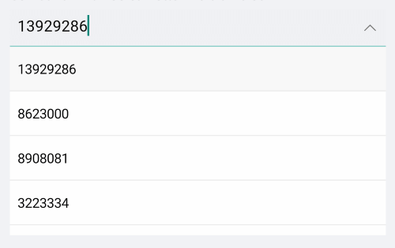

# Key Features

The purpose of this help article is to show you the key features of the **RadComboBox** control. 

## Data Binding

You could set static items to the control's ItemsSource or binding it to a complex object using the `DisplayMemberPath` property. For more information please check the [ComboBox Data Binding]() article.

## Placeholder

* **Placeholder**(*string*): The text which is used to give guidance to the end user on what should be entered/searched in the input. The watermark text is displayed when the input field is empty, or the selected item/s is/are cleared. 
* **PlaceholderColor**(*Color*): Defines the color for the watermark text. 

Here is an example of setting the `Placeholder` property:

<snippet id='combobox-keyfeatures-placeholder'/>

and the result:

## Text

* **Text**(*string*): Specifies the Text of the control. When the ComboBox is in editable state, The Text is the text in the box. When it is in non-editable state and selection mode is single this is the text from the default template of the selected item.

## ClearButton Visibility

The visibility state of the Clear **X** button can be changed using the `IsClearButtonVisible`(*bool*) property. By default its value is true.

Here is an example with `IsClearButtonVisible` property set:

<snippet id='combobox-keyfeatures-clearbuttonvisible-false'/>

and the result: 

## DropDown Behavior

ComboBox provides the following properties for managing the drop down visbility:

* **IsDropDownOpen**(*bool*): Defines whether the drop down part of the control is opened. Default value is `false`. 
* **IsDropdownClosedOnSelection**(*bool*): Defines whether the drop down should be closed when item is selected/deselected. The default value is `false`.

Here is an example with `IsDropdownClosedOnSelection` property set:

<snippet id='combobox-keyfeatures-dropdownvisibility-isdropdownclosed'/>

* **OpenOnFocus**(*bool*):Defines whether the drop down should be opened when the control is focused. The default value is `false`. It is only applicable for Editable ComboBox. So the IsEditable property should be set to true.

Here is an example with `OpenOnFocus` property set:

<snippet id='combobox-keyfeatures-dropdownvisibility-openonfocus'/>

## Keyboard

The **Keyboard** property of type *Xamarin.Forms.Keyboard* allows you to define the type of the keyboard that will be visualized by the device. The default value is Text.

## Editing

ComboBox supports both editable and noneditable state. When the control is in edit mode searching can be performed. For more details please check the [Editing]() article.

## Searching

ComboBox provides both case-sensitive and case-insensitive searching modes. The available options are: Contains, StartsWith, ContainsCaseSensitive and StartsWithCaseSensitive. Please check the [Searching]() article for more details and a sample demo. 

## Selection

ComboBox control has a support for single and multiple selection. You can easily specify the required selection using the `SelectionMode` property. You can check all properties, event and commands provided for the selection feature in the [Combobox Selection]() article.

>important The Key Features example can be found in our [SDK Browser Application](developer-focused-examples). You can find the applications in the **Examples** folder of your local **Telerik UI for Xamarin** installation or in the following [GitHub repo](https://github.com/telerik/xamarin-forms-sdk).

## See Also

- [ComboBox]() 
- [Editing]() 
- [Searching]() 
- [Selection]() 
