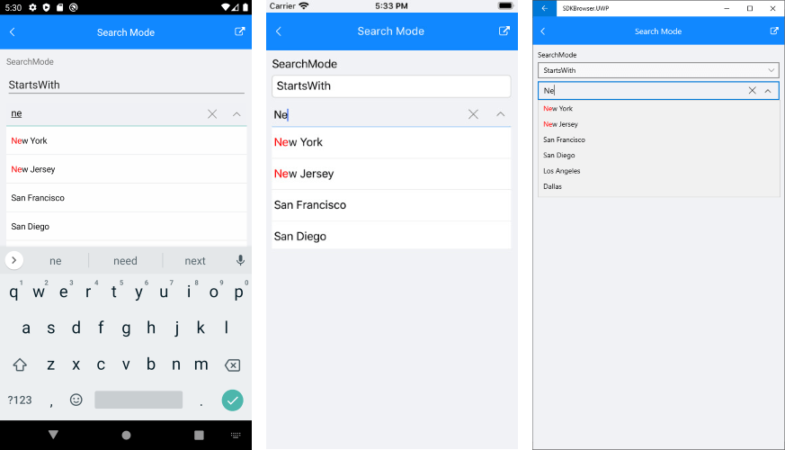

# Searching

ComboBox provides both case-sensitive and case-insensitive searching modes. The following properties are exposed:

- **SearchMode** (enumeration of type *Telerik.XamarinForms.Input.SearchMode*): Defines the value that sets search sets some search criteria for the control. The available options are: `Contains`, `StartsWith`, `ContainsCaseSensitive` and `StartsWithCaseSensitive`. The default SearchMode is `StartsWith`.
- **SearchTexhPath**(*string*): Specifies the name of the property against which the searching will be performed.
* **HighlightTextColor** (*Xamarin.Forms.Color*): Defines the color of the text that will be highlighted when searching is performed.

> Searching can be performed when `IsEditable` is set to `true`.

## Example

Here is the ComboBox definition in XAML:

<snippet id='combobox-searching-moode'/>

>note When binding to a complex objects, ComboBox `DisplayMemberPath` property should be set. When you want to achieve Searching set `IsEditable` to `true` and `SearchTextPath`.

In addition to this, you need to add the following namespace:

<snippet id='xmlns-telerikinput'/>

the sample business model

<snippet id='combobox-store-businessmodel'/>

and the ViewModel used:

<snippet id='combobox-searching-mode-viewmodel'/> 

Here is how the control looks when searching is performed:

>important The SearchingMode example can be found in our [SDK Browser Application](developer-focused-examples). You can find the applications in the **Examples** folder of your local **Telerik UI for Xamarin** installation or in the following [GitHub repo](https://github.com/telerik/xamarin-forms-sdk).

## See Also

- [Key Features]()
- [Single and Multiple Selection]()
- [Templates]()
- [Styling]()
