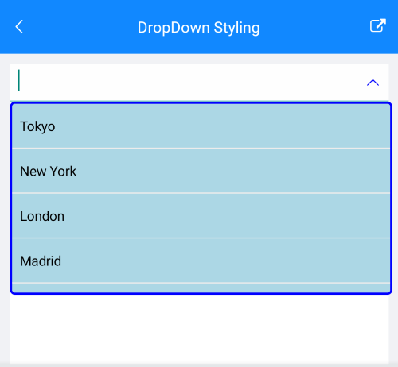

# Theming and Style

## ComboBox Styling

ComboBox control for Xamarin provides the following Style properties for customizing its look:

* **PlaceholderColor**(*Xamarin.Forms.Color*): Defines the color for the placeholder text.
* **TextColor**(*Xamarin.Forms.Color*): Defines the color of the text when the control is editable and color of the selected item when it is not editable and selection mode is single.
* **BackgroundColor**(*Xamarin.Forms.Color*): Defines the background color of the control.
* **BorderColor**(*Xamarin.Forms.Color*): Defines the color of the border.
* **BorderThickness**(*Xamarin.Forms.Color*): Defines the thickness of the border.
* **FocusedBorderColor**(*Xamarin.Forms.Color*): Defines the color of the nborder when the control is focused.
* **ClearButtonStyle**(of type *Style* with target type *Xamarin.Forms.Button*): Defines the style for the clear button.
* **Font Options**(`FontAttributes`, `FontFamily`, `FontSize`): Define the font options to the text of the RadComboBox. It is applied to the Placeholder, Selected Text(for single selection) and when the control is in Editable Mode.

### Example for ComboBox Styling

Here is the ComboBox definition in XAML:

<snippet id='combobox-styling'/>

in addition you will need to add the following namespace:

<snippet id='xmlns-telerikinput'/>

the sample business model

<snippet id='combobox-city-businessmodel'/>

and the ViewModel used:

<snippet id='comobobox-editing-viewmodel'/> 

Here is how the Combobox looks when styling is applied:

Here is how the styling is applied when the control is focused and item is selected:

>important The ComboBox Styling example can be found in our [SDK Browser Application](). You can find the applications in the **Examples** folder of your local **Telerik UI for Xamarin** installation or in the following [GitHub repo](https://github.com/telerik/xamarin-forms-sdk).

## DropDown Styling

The following properties styles the ComboBox Drop Down:

* **DropDownBorderColor**(*Xamarin.Forms.Color*): Defines the color of the border around the drop down part of the control.
* **DropDownBorderThickness**(*Xamarin.Forms.Thickness*): Defines the thickness of the border that is around of the drop down part of the control.
* **DropDownBorderCornerRadius**(*Xamarin.Forms.Thickness*): Defines the corner radius of the border that is around the drop down part of the control
* **DropDownBackgroundColor**(*Xamarin.Forms.Color*): Defines the background color of the drop down part of the control.
* **DropDownButtonStyle**(of type *Style* with target type *Xamarin.Forms.Button*): Defines the style for the drop down button.

### Example Drop Down Styling

Here is the ComboBox definition in XAML:

<snippet id='combobox-dropdown-styling'/>

add the following namespace:

<snippet id='xmlns-telerikinput'/>

The DropDown Button Style is defined in the Page's ResourceDictionary:

<snippet id='combobox-dropdownbutton-style'/>

the sample business model

<snippet id='combobox-city-businessmodel'/>

and the ViewModel used:

<snippet id='comobobox-editing-viewmodel'/> 

Here is how the Drop Down Styling looks:

>important The DropDown Styling example can be found in our [SDK Browser Application](). You can find the applications in the **Examples** folder of your local **Telerik UI for Xamarin** installation or in the following [GitHub repo](https://github.com/telerik/xamarin-forms-sdk).

## Theming

## See Also

- [CheckBox Getting Started]()
- [CheckBox Key Features]()
