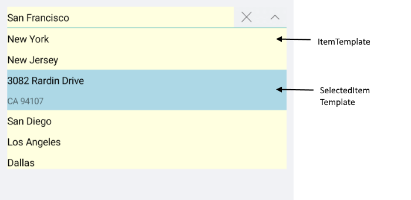

# Templates

If the default templates of the control do not suit your needs, you can easily define custom ones. The available templates for customizing are:

* **ItemTemplate**(*DataTemplate*): Defines the template of the items that are visualized in the drop-down list.
* **SelectedItemTemplate**(*DataTemplate*): Defines the template of the selected items that are visualized in the drop-down list.
* **TokenTemplate**(*DataTemplate*):  Defines the template of the tokens that are visualized when multiple selection is performed. The value is SuggestionTemTemplate
* **ShowMoreTemplate**(*DataTemplate*): Defines the Template of the show more UI that gets visualized when the control is not focused and there is not enough space for all Tokens to be visualized when the selection mode is multiple.

## Example with ItemTemplate and SelectedItemTemplate

Here is the ComboBox definition in XAML:

<snippet id='combobox-item-selecteditem-templates'/>

the sample business model

<snippet id='combobox-store-businessmodel'/>

and the ViewModel used:

<snippet id='combobox-searching-mode-viewmodel'/>

The final result: 

>important The Item and SelectedItem Template example can be found in our [SDK Browser Application](developer-focused-examples). You can find the applications in the **Examples** folder of your local **Telerik UI for Xamarin** installation or in the following [GitHub repo](https://github.com/telerik/xamarin-forms-sdk).

## Example with TokenTemplate and ShowMoreTemplate

Here is the ComboBox definition in XAML:

<snippet id='combobox-tokentemplate'/>

the sample business model

<snippet id='combobox-city-businessmodel'/>

and the ViewModel used:

<snippet id='comobobox-editing-viewmodel'/>

> when the default TokenTemplate is overriden, you will need to implement custom logic for removing the tokens from the ComboBox:

here is a sample logic removing the token when adding TapGestureRecognizer to the Label:

<snippet id='remove-the-selecteditem'/>

Here is the how the Token and ShowMore Templates look:

>important The Token and ShowMore Template example can be found in our [SDK Browser Application](developer-focused-examples). You can find the applications in the **Examples** folder of your local **Telerik UI for Xamarin** installation or in the following [GitHub repo](https://github.com/telerik/xamarin-forms-sdk).

## See Also

- [Key Features]()
- [Header and Footer]()
- [Searching]()
- [Single and Multiple Selection]()
- [Styling]()
