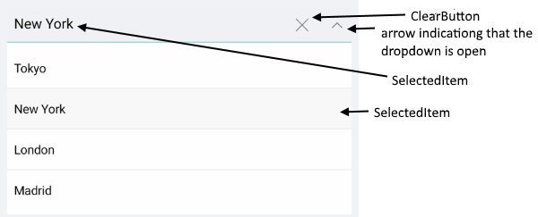
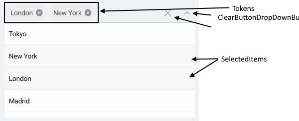

# Visual Structure of ComboBox for Xamarin

Here are described all visual elements used in the ComboBox for Xamarin.

## ComboBox Visual Structure

### Single Selection

### Multiple Selection

## DropDown Visual Structure

### Single Selection

### Multiple Selection

## Legend

- **Placeholder** - The text which is used to give guidance to the end user on what should be entered/searched in the input.
- **ClearButton** - the button which clears the selected item/items. When single selection is used, the clear button clears the item displayed inside the combobox. When multiple selection is used the clear button clears all items inside the combobox.
- **Tokens** - When multiple items are selected from the dropdown list, these items appear as tokens. They can easily be deselected using their close button.
- **SelectedItem** - The currently selected items
- **SelectedItems** - when mulptiple selection mode is used.
- **arrow for opening/closing the DropDown** - indicating when the dropdown box is opened/closed.

>important **SDK Browser** and **QSF** applications contain different examples that show RadComboBox's main features. You can find the applications in the **Examples** and **QSF** folders of your local **Telerik UI for Xamarin** installation.
