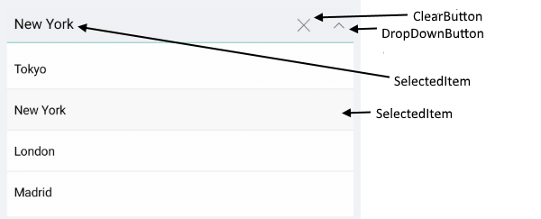
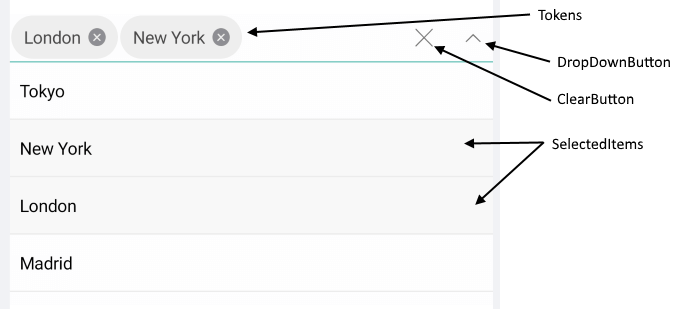

# Visual Structure of ComboBox for Xamarin

Here are described all visual elements used in the ComboBox for Xamarin.

## ComboBox Visual Structure

### Single Selection

### Multiple Selection

## DropDown Visual Structure

### Single Selection

### Multiple Selection

## Legend

- **Placeholder** - The text which is used to give guidance to the end user on what should be entered/searched in the input.
- **ClearButton** - Clears the selection of the control both multiple and single.
- **Tokens** - When multiple items are selected from the dropdown list, these items appear as tokens. They can easily be deselected using their close button.
- **SelectedItem** - The currently selected item.
- **SelectedItems** - The selected items, when mulptiple selection is used.
- **DropDownButton** - A button used for opening and closing the DropDown part of the control – the arrow icon of the button indicates whether it is currently opened or closed.

>important **SDK Browser** and **QSF** applications contain different examples that show RadComboBox's main features. You can find the applications in the **Examples** and **QSF** folders of your local **Telerik UI for Xamarin** installation.
