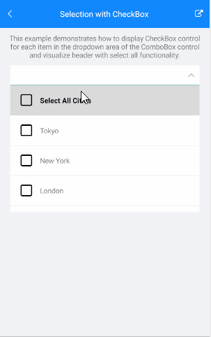
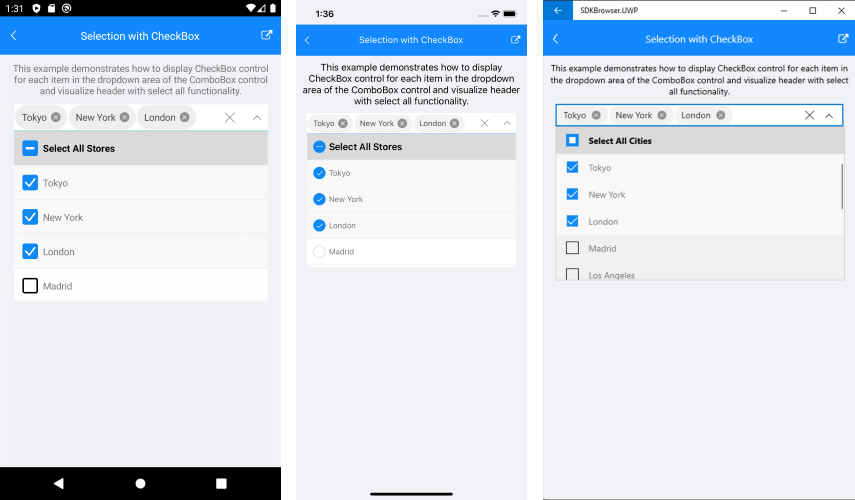

# ComboBox with CheckBox

The following article will show you how to display checkbox for each item inside the ComboBox drop down, select item using the CheckBox control and visualize header inside the drop down part with Select All functionality. 
  

## Example

Here are the steps needed to achieve the functionality describe above.

The ComboBox definition in XAML:

<snippet id='combobox-howto-selection-checkbox'/>

Lets define the CheckBox control inside the ComboBox ItemTemplate: 

<snippet id='combobox-howto-selection-checkbox-itemtemplate'/>

and in SelectedItemTemplate:

<snippet id='combobox-howto-selection-checkbox-selecteditemtemplate'/>

Then lets add a checkbox inside the Drop Down HeaderTemplate. In this way we can select/unselect all items from the drop down list. 

<snippet id='combobox-howto-selection-checkbox-headertemplate'/>

the business model used: 

<snippet id='combobox-city-businessmodel'/>

In addition, there is a logic inside the ViewModel whether the selection is made internally of from the UI - SelectAll option. 

Here is the ViewModel used:

<snippet id='combobox-howto-selection-checkbox-viewmodel'/> 

This is the result:

> Example for ComboBox with CheckBox selection can be found in the [ComboBox/How To](https://github.com/telerik/xamarin-forms-sdk/tree/master/XamarinSDK/SDKBrowser/SDKBrowser/Examples/ComboBox/HowTo/SelectionWithCheckBoxExample) section from the SDK Browser Application.

## See Also

- [Key Features]()
- [Data Binding]()
- [Editing]()
- [Searching]()
- [Templates]()
