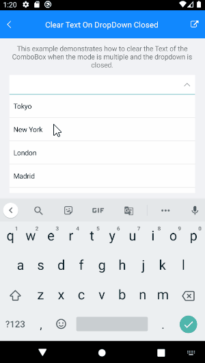

# ComboBox Clear Text when DropDown is Closed

The following article will show you how to clear the Text of the ComboBox when the `SelectionMode` is `Multiple` and the dropdown is closed.

## Example

Here are the steps needed to achieve the functionality describe above.

First, if we want to clear the Text, the control should be in Editable mode. In addition we will use Multiple Selection: 

<snippet id='combobox-howto-cleartext-dropdown-closed'/>

Inside the ComboBox `Unfocused` event we will set the `ComboBox.Text` prioperty to `srting.Empty`:

<snippet id='combobox-cleartext-dropdown-closed-unfocused'/>

the business model used: 

<snippet id='combobox-city-businessmodel'/>

Here is the ViewModel used:

<snippet id='combobox-cleartext-dropdown-closed-viewmodel'/> 

> Example for Clear Text when DropDown is closed can be found in the [ComboBox/How To](https://github.com/telerik/xamarin-forms-sdk/tree/master/XamarinSDK/SDKBrowser/SDKBrowser/Examples/ComboBox/HowTo/ClearTextOnDropDownExample) section from the SDK Browser Application.

## See Also

- [Key Features]()
- [Data Binding]()
- [Editing]()
- [Searching]()
- [Templates]()
