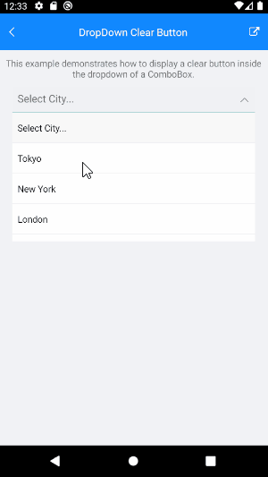

# ComboBox with Clear Selection in Drop Down

The following article will show you how to display a clear button inside the dropdown of a ComboBox and clar the selected item from it.

## Example

For this example we will need to add the clear button (in our case for the demo we will use a Label) inside the drop down header. So we will use the ComboBox `HeaderTemplate` property. 

<snippet id='combobox-howto-dropdown-clearbutton-headertemplate'/>

Here is the ComboBox definition: 

<snippet id='combobox-howto-dropdown-clearbutton'/>

the business model used: 

<snippet id='combobox-city-businessmodel'/>

Next we will need a clear selection command in our ViewModel, then bind it to the Label.TapGestureRecognizer Command inside the HeaderTemplate. Here is the ViewModel used:

<snippet id='combobox-howto-dropdown-clearbutton-viewmodel'/> 

> Example for Clear Selection in DropDown can be found in the [ComboBox/How To](https://github.com/telerik/xamarin-forms-sdk/tree/master/XamarinSDK/SDKBrowser/SDKBrowser/Examples/ComboBox/HowTo/DropDownClearButtonExample) section from the SDK Browser Application.

## See Also

- [Key Features]()
- [Data Binding]()
- [Editing]()
- [Searching]()
- [Templates]()
