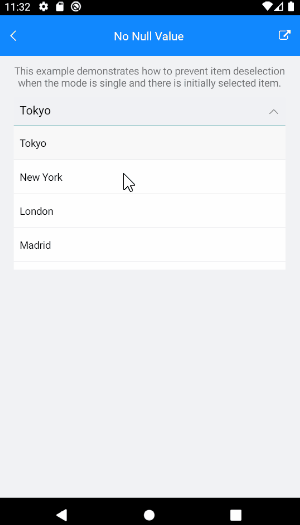

# ComboBox with No Null Values

The following article will show you how to prevent item deselection when the ComboBox selection mode is single and there is initially selected item.

Here are the steps needed to achieve the functionality describe above.

To prevent item deselection we will need to set `IsClearButtonvisible` to `False` and `SelectionMode` to `Single` Here is the ComboBox definition in XAML

<snippet id='combobox-no-null-values'/>

the business model used: 

<snippet id='combobox-city-businessmodel'/>

Mainly inside the ViewModel you will need to declare a property and bind it to the ComboBox `SelectedItem` property, then set a value for this property in the ViewModel's contructor:

<snippet id='combobox-nonull-values-viewmodel'/> 

> Example for ComboBox No Null Value can be found in the [ComboBox/How To](https://github.com/telerik/xamarin-forms-sdk/tree/master/XamarinSDK/SDKBrowser/SDKBrowser/Examples/ComboBox/HowTo/NoNullValueExample) section from the SDK Browser Application.

## See Also

- [Key Features]()
- [Data Binding]()
- [Editing]()
- [Searching]()
- [Templates]()
