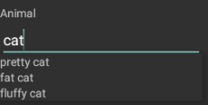

# Further Customization

## Android

This example will demonstrate how to add an auto-complete editor for a property called Animal on Android.

First you have to specify that a custom editor will be used for this property.

	dataForm.RegisterEditor("Animal", EditorType.Custom);

Then you have to inherit from the default **DataFormRenderer** and override the some of its methods.

	public class CustomRendererDroid : DataFormRenderer
	{
	    private readonly Java.Lang.Object[] items = new Java.Lang.Object[] { "pretty cat", "fat cat", "fluffy cat" };
	
	    protected override EntityPropertyEditor GetCustomEditorForProperty(RadDataForm form, IEntityProperty property, EntityPropertyMetadata metadata)
	    {           
	        if (property.Name() == "Animal")
	        {
	            return new DataFormAutoCompleteEditor(form, property);
	        }
	
	        return base.GetCustomEditorForProperty(form, property, metadata);
	    }
	
	    protected override void UpdateEditor(EntityPropertyEditor editor, EntityPropertyMetadata metadata)
	    {
			base.UpdateEditor(editor, metadata);

	        if (editor.Property().Name() == "Animal")
	        {
	            var autoComplete = editor.EditorView as AutoCompleteTextView;
	            autoComplete.Adapter = new ArrayAdapter(Forms.Context, Resource.Layout.data_form_autocomplete_item, this.items);
	        }
	    }
	}

You have to define the **data\_form\_autocomplete\_item** resource in the **Resources\\layout** folder of the Android project. If the folder is missing, you have to create it. Then add the the following file: data\_form\_autocomplete\_item\.xml

    <?xml version="1.0" encoding="utf-8"?>
    <TextView xmlns:android="http://schemas.android.com/apk/res/android"
    android:id="@+id/data_form_autocomplete_item"
    android:layout_width="wrap_content"
    android:layout_height="wrap_content"/>

After that you will have to replace the default **DataFormRenderer** with the new one in **MainActivity.cs**:

	[assembly: ExportRenderer(typeof(Telerik.XamarinForms.Input.RadDataForm), typeof(CustomRendererDroid))]

Result:

## iOS

This example will demonstrate how to add custom editors in iOS DataForm.

First, create a sample class.
 
	public class Account
	{
	    [DisplayOptions(Header="User Name", PlaceholderText = "user name", Group = "Registration Info")]
	    [StringLengthValidator(5, 30, "User name should be longed than 5 symbols.")]
	    public string UserName { get; set; }
	
	    [DisplayOptions(Header = "Email", PlaceholderText = "email", Group = "Registration Info")]
	    public string Email { get; set; }
	
	    [DisplayOptions(Header = "Password", PlaceholderText = "password", Position = 2, Group = "Registration Info")]
	    [StringLengthValidator(5, 30, "Password should be longed than 5 symbols.")]
	    public string Password { get; set; }
	}

Then, setup the source and register the editor types.
 
	dataForm.Source = new Account();

	dataForm.RegisterEditor("Email", EditorType.Custom);
	dataForm.RegisterEditor("Password", EditorType.Custom);
	dataForm.RegisterEditor("Date", EditorType.DateEditor);

After that, you have to inherit from the default **DataFormRenderer** and override the some of its methods.

	public class CustomRendererIOS : DataFormRenderer
	{
	    protected override Type GetCustomEditorType(string propertyName, Type propertyType)
	    {
	        if (propertyName == "Email")
	        {
	            return typeof(TKDataFormEmailEditor);
	        }
	
	        if (propertyName == "Password")
	        {
	            return typeof(TKDataFormPasswordEditor);
	        }
	
	        return base.GetCustomEditorType(propertyName, propertyType);
	    }
	}

Finally, replace the default **DataFormRenderer** with the new one in **AppDelegate.cs**:

	[assembly: ExportRenderer(typeof(Telerik.XamarinForms.Input.RadDataForm), typeof(CustomRendererIOS))]
		
## See Also
- [Editors]()
- [Members]()