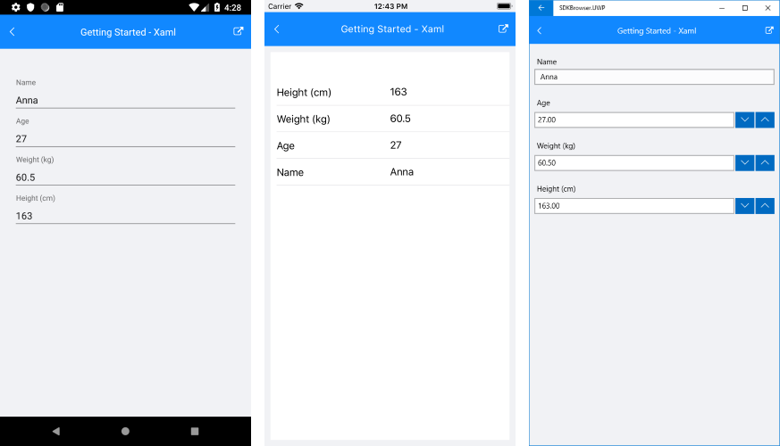

# Getting Started #

This article will guide you through the steps needed to add a basic **RadDataForm** control in your application.

* [Setting up the app](#1-setting-up-the-app)
* [Adding the required Telerik references](#2-adding-the-required-telerik-references)
* [Adding RadDataForm control](#3-adding-raddataform-control)
* [Setting RadDataForm Source object](#4-populating-radlistview-with-data)

## 1. Setting up the app

Take a look at these articles and follow the instructions to setup your app:

- [Setup app with Telerik UI for Xamarin on Windows]()
- [Setup app with Telerik UI for Xamarin on Mac]()

## 2. Adding the required Telerik references

You have two options:

* Add the Telerik UI for Xamarin Nuget package following the instructions in [Telerik NuGet package server]() topic.

If you don't want to add the all Telerik.UI.for.Xamarin nuget package, you have the option to add a separate nuget package. For RadDataForm control you have to install the **Telerik.UI.for.Xamarin.Input** nuget package. This nuget will automatically refer the Telerik.UI.for.Xamarin.Primitives, Telerik.UI.for.Xamarin.Common, and Telerik.UI.for.Xamarin.DataControls nuget packages. In additon inside the UWP project you will need to add a reference to the *Telerik.UI.Xaml.Controls.Data.UWP* dll.

* Add the references to Telerik assemblies manually, check the list below with the required assemblies for **RadDataForm** component:

 Platform | Assemblies |
| -------- | ---------- |
| Portable | Telerik.XamarinForms.Common.dll<br/>Telerik.XamarinForms.Input.dll |
| Android  | Telerik.Xamarin.Android.Common.dll<br/>Telerik.Xamarin.Android.Data.dll<br/> Telerik.Xamarin.Android.List.dll<br/> Telerik.Xamarin.Android.Input.dll<br/>Telerik.Xamarin.Android.Primitives.dll<br/>Telerik.XamarinForms.Common.dll<br/>Telerik.XamarinForms.Input.dll |
| iOS      | Telerik.Xamarin.iOS.dll<br/>Telerik.XamarinForms.Common.dll<br/>Telerik.XamarinForms.Input.dll |
| UWP      | Telerik.Core.dll<br/>Telerik.Data.dll<br/>Telerik.UI.Xaml.Controls.Data.UWP.dll<br/>Telerik.UI.Xaml.Input.UWP.dll<br/>Telerik.UI.Xaml.Primitives.UWP.dll<br/>Telerik.XamarinForms.Common.dll<br/>Telerik.XamarinForms.Input.dll<br/>|

## 3. Adding RadDataForm control

You could use one of the following approaches:

#### Drag the control from the Toolbox. 

Take a look at the following topics on how to use the toolbox:

* [Telerik UI for Xamarin Toolbox on Windows]()
	
#### Create the control definition in XAML or C#.

The snippet below shows a simple RadDataForm definition:

```XAML
<telerikInput:RadDataForm x:Name="dataForm" />
```
```C#
var dataForm = new RadDataForm();
```

In addition to this, you need to add the following namespace:

<snippet id='xmlns-telerikinput' />
<snippet id='ns-telerikinput' />

## 4. Setting RadDataForm Source object

First, let's create a sample class that will be the source of the data form:

<snippet id='dataform-gettingstarted-source'/>

Assign it to the **Source** property of RadDataForm:

<snippet id='dataform-gettingstarted-setup-xaml'/>
<snippet id='dataform-gettingstarted-setup-csharp'/>

You also need to add the following namespace:

<snippet id='xmlns-telerikinput'/>
<snippet id='ns-telerikinput'/>

After that you have to specify the editor types:

<snippet id='dataform-gettingstarted-register-editors'/>

This is the result:



>important **SDK Browser** and **QSF** applications contain different examples that show RadDataForm's main features. You can find the applications in the **Examples** and **QSF** folders of your local **Telerik UI for Xamarin** installation.
	
## See Also

- [DataForm Editors]()
- [Project Wizard]()
- [Getting Started on Windows]()
- [Getting Started on Mac]()