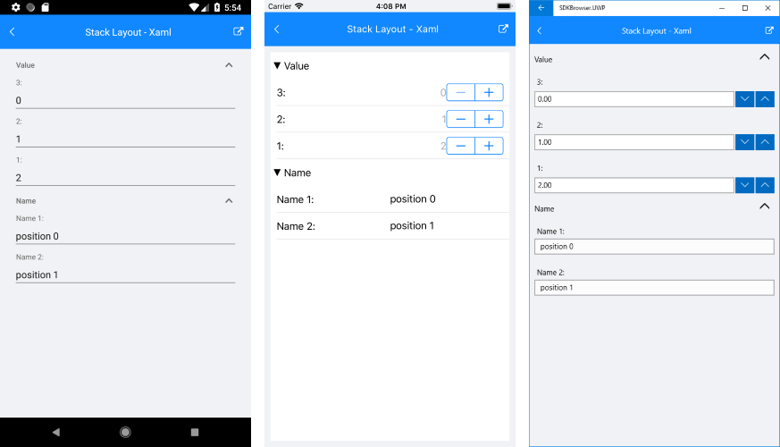
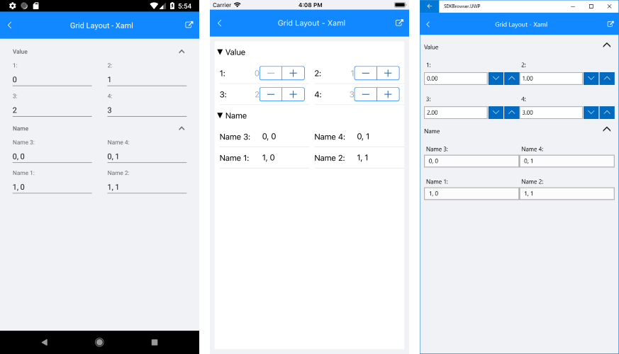

# DataForm Group Layouts

## Properties

RadDataForm supports different group layouts through the following properties:

- **GroupLayoutDefinition**: Gets or sets a layout definition that will be used to arrange editors in all data form groups.
- **GroupLayoutDefinitionSelector**: Gets or sets a layout definition selector that applies specific layout for each group.

> If no groups are defined all editors are arranged in a default group.

The information for editors arrangement is defined in the source class metadata with the [DisplayOptionsAttribute](). Here are all **DisplayOptionsAttribute** properties that are interpreted by the layouts:

- **Position**: default value: 0
- **ColumnPosition**: default value: 0
- **ColumnSpan**: default value: 1

 
## Stack Layout Definition

The **DataFormGroupStackLayoutDefinition** arranges the editors in stack ordered by the DisplayOptions **Position** value.

Here is a sample source object class:

<snippet id='dataform-grouplayouts-stacklayout-sourceitem'/>

The following sample demonstrates how to set stack layout for all groups:

<snippet id='dataform-grouplayouts-stacklayout-xaml'/>
<snippet id='dataform-grouplayouts-stacklayout-csharp'/>

Here is the result:

## Grid Layout Definition

The **DataFormGroupGridLayoutDefinition** arranges the editors in grid. Each editor is placed at position defined by the DisplayOptions **Position** (row) and **ColumnPosition** (column) values. The number of columns that the editor occupies is defined by the DisplayOptions **ColumnSpan** property.

Here is a sample source object class:

<snippet id='dataform-grouplayouts-gridlayout-sourceitem'/>

The following sample demonstrates how to set grid layout for all groups:

<snippet id='dataform-grouplayouts-gridlayout-xaml'/>
<snippet id='dataform-grouplayouts-gridlayout-csharp'/>

Here is the result:

## Layout Definition Selector

Sometimes different layout is required for each group. In these cases you can use the layout definition selector. This is a class that implements the **IDataFormGroupLayoutDefinitionSelector** interface and provides layout definition for each group.

Here is a sample layout definition selector class:

<snippet id='dataform-grouplayouts-layoutselector-selector'/>

Here is a sample source object class:

<snippet id='dataform-grouplayouts-stacklayout-sourceitem'/>

The following sample demonstrates how to use layout selector in data form:

<snippet id='dataform-grouplayouts-stacklayout-xaml'/>
<snippet id='dataform-grouplayouts-stacklayout-csharp'/>

Here is the result:

## See Also

- [DataForm Source]()
- [DataForm Editors]()
- [Validate and Commit]()