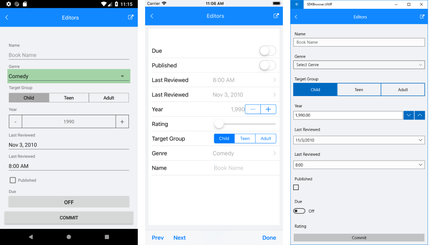

## Overview

RadDataForm is a customizable component allowing you to easily create a form for collecting or editing business object data. The control supports different commit modes allowing you to commit property values one by one or commit the whole form at once. You could also determine at what moment the properties should be validated choosing between different validation modes. The control lets you use rich set of editors out of the box.

> **RadDataForm** is available for the following platforms:
> 
> - **Android**
> - **iOS**
> - **Windows 8.1**
> - **Windows Phone 8.1**
> - **Universal Windows Platform**

