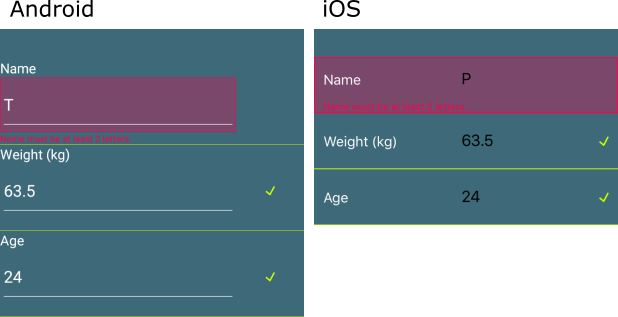

# Editors Styling

The RadDataForm editors appearance can be customized with the EditorStyle property of type DataFormEditorStyle. The DataFormEditorStyle exposes the following properties:

- **Height** (double): Sets the height of the editors.
- **Background** (Background): Sets the background of the editors.
- **HeaderForeground** (Color): Sets the foreground of the editors header.
- **HeaderFontSize** (double): Sets the font size of the editors header.
- **FeedbackFontSize** (double): Sets the font size of the feedback message.
- **FeedbackImageSize** (Size): Sets the size of the feedback image.
- **PositiveFeedbackForeground** (Color): Sets the foreground for the positive feedback message.
- **NegativeFeedbackForeground** (Color): Sets the foreground for the negative feedback message.
- **PositiveFeedbackBackground** (Background): Sets the background for positive feedback.
- **NegativeFeedbackBackground** (Background): Sets the background for negative feedback.
- **PositiveFeedbackImage** (ImageSource): Sets the image for the positive feedback.
- **NegativeFeedbackImage** (ImageSource): Sets the image for the negative feedback.

## Example

	var positive = "CCFF00";
	var negative = "FF004C";
	
	var style = new DataFormEditorStyle
	{
	    Background = new Background
	    {
	        Fill = Color.Transparent,
	        StrokeColor = Color.FromHex(positive),
	        StrokeWidth = 1,
	        StrokeLocation = Location.Bottom
	    },
	    HeaderFontSize = 15,
	    HeaderForeground = Color.White,
	    FeedbackFontSize = 10,
	    PositiveFeedbackImage = ImageSource.FromFile("success.png"),
	    NegativeFeedbackForeground = Color.FromHex(negative),
	    NegativeFeedbackBackground = new Background
	    {
	        Fill = Color.FromHex(50 + negative),
	        StrokeColor = Color.FromHex(negative),
	        StrokeWidth = 2,
	        StrokeLocation = Location.All
	    },
	    Height = 60,
	    FeedbackImageSize = new Size(10, 10),
	};
	
	dataForm.EditorStyle = style;
	dataForm.BackgroundColor = Color.FromHex("3D6978");

Result:

