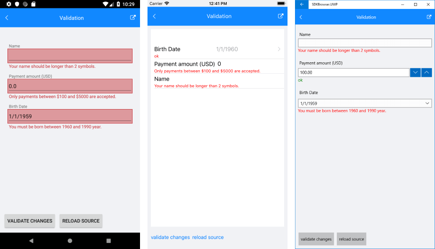
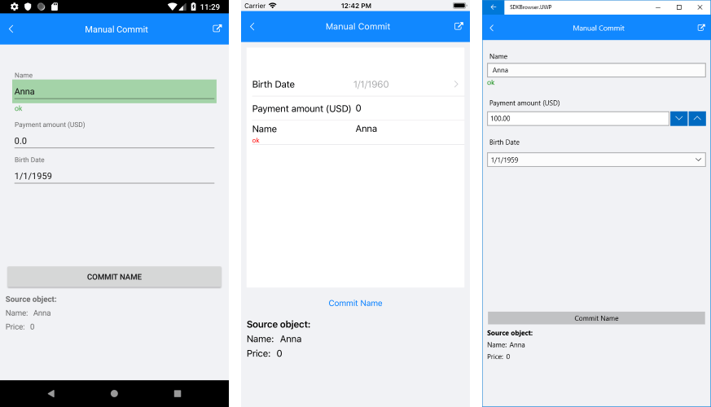

## Validate

RadDataForm for Xamarin provides built-in validation, which gives you full control over the data collected through the control. You could specify the validation rules for each property of the source object through [Validation Annotations]().

The next sections list all DataForm members related to validation.

#### Validation modes

You could choose between three validation modes described below:

* **Immediate**: Property value is validated after every change in editor. 
* **OnLostFocus**: Property value is validated after editor looses focus.
* **Manual**: Property value is validated only with explicit call of a validate method or on commit.

The selected mode is applied through **ValidationMode** property of the DataForm control.

#### Manual validation through methods

RadDataForm provides the following methods you can use in case of manual validation mode:

* **ValidateAll**(): Validates all properties and when finished, raises the **FormValidationCompleted** event.
* **ValidateProperty**(string *propertyName*): Validates the property with the specified name and when finished raises the **PropertyValidationCompleted** event.

#### Validation events

You can use the validation events below to get notified when RadDataForm has validated its fields.

* **FormValidationCompleted**: Occurs when all form properties are validated. Provides a list of failed properties.
* **PropertyValidationCompleted**: Occurs when a property validation has finished. Provides information about whether the property has passed validation.

#### Example

The example below shows how you could use Manual ValidationMode with RadDataForm.

First, create a sample *User* object with a few validation annotations added:

<snippet id='dataform-validate-source' />

Add RadDataForm definition with ValidationMode property applied:

<snippet id='dataform-validate-xaml' />

Set the BindingContext to a new *User* object and register the needed editors:

<snippet id='dataform-validate-code' />

Check the event handler of the FormValidationCompleted event below:

<snippet id='dataform-validate-event-code' />

The defined validation rules will be executed as soon as any of the validation methods is called or the dataform is committed. You could use, for example, **ValidateAll** method:

<snippet id='dataform-validate-method' />

The image below shows how RadDataForm will look when ValidateAll is called:

## Commit

The values entered in the DataForm can be submitted to the underlying data object on three different occasions, using the **CommitMode** property of the DataForm. 

All members related to committing are listed below:

#### Commit Modes

You could choose between three commit modes described below:

* **Immediate**: Property value is committed after each change in the editor. 
* **OnLostFocus**: Property value is committed after editor looses focus.
* **Manual**: Property value is committed only with explicit call of commit method.

The selected mode is applied through **CommitMode** property of the DataForm control.

#### Manual commit through methods

RadDataForm provides the following methods you can use in case of manual commit mode:

* **CommitAll**(): Commits all properties.
* **CommitProperty**(string *propertyName*): Commits the property with the specified name.

> All commit methods call validation first. If the property value passes validation, then the corresponding validation finished event is raised and the value is committed successfully.

#### Example

The example below demonstrates how you could utilize Manual CommitMode and CommitProperty methods.

Let's use the same *User* object from the previous Validation example.

The next step is to add a DataForm control with CommitMode applied:

<snippet id='dataform-commit-xaml' />

You could submit the entered "Name" value like shown in the snippet below. 

<snippet id='dataform-commit-method' />

The image below displays RadDataForm with submitted "Name" property.

>important Sample examples demonstrating validation and commit features of DataForm control can be found inside the RadDataForm -> Commit/Validate section within the [SDK Samples Browser application]().

## See Also

- [ditors]()
- [DataForm Annotations]()