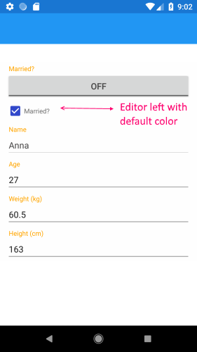
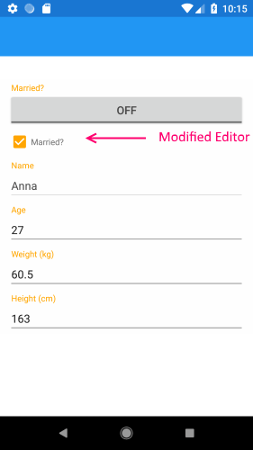

## How to Modify RadDataForm's TelerikTheme Resources in Android

When applying the **TelerikTheme** to the Telerik controls within your application and respectively the **RadDataForm** element, you have the option to [Modify the default theme]() by overriding the values of the resources used within it. You can modify RadDataForm's resources so that different colors than the default ones are applied. For example:

	<!-- DataForm -->
	<Color x:Key="TelerikDataFormEditorAccentColor">Orange</Color>
	<Color x:Key="TelerikDataFormBackgroundColor">White</Color>
	<Color x:Key="TelerikDataFormHeaderFontColor">Orange</Color>
	<Color x:Key="TelerikDataFormEditorBorderColor">Orange</Color>

If you run your application in Android at this stage you will notice that not all elements are modified as expected:

#### Figure 1: DataForm unmodified Editors

As the **RadDataForm** is built on top of a truly native DataForm element and also uses native elements as editors, modifying the appearance of these elements requires some additional steps. The control relies on some  Android styles which are applied to the editors in case of setting the **TelerikTheme** class for the control. Here are all the native styles applied to the different type of editors:

    

    

    

    

    

    

    

    

    

    

In case you need to modify a specific style of the above, you can copy that style into the **Resources/values/styles.xml** file within the Android Project of the Xamarin.Forms solution and change the colors there. 

#### Example: Changing CheckBoxEditor's Background color to Orange:

Simply copy the whole CustomCheckBoxEditorThemeBlue style and place it at the bottom of the styles.xml file located in the Resources/values folder of the Android Project. Eventually, you can change the colors to orange:

	<?xml version="1.0" encoding="utf-8" ?>
	<resources>
	
	   . . .
	  
	</resources>

Here is the appearance of the CheckBoxEditor once this style is added:

## See Also
- [Autocomplete editor in Android]()
- [Email and Password Editors in iOS]()
- [Editors]()
- [Members]()