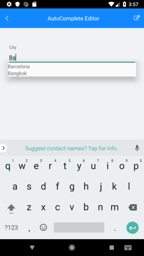

## Autocomplete editor in Android

This example will demonstrate how to add an auto-complete editor for a property called Animal on Android.

First you have to specify that a custom editor will be used for this property.

	dataForm.RegisterEditor("Animal", EditorType.Custom);

Then you have to inherit from the default **DataFormRenderer** and override the some of its methods.

	public class CustomRendererDroid : DataFormRenderer
	{
	    private readonly Java.Lang.Object[] items = new Java.Lang.Object[] { "pretty cat", "fat cat", "fluffy cat" };
	
	    protected override NativeCore.EntityPropertyEditor GetCustomEditorForProperty(NativeViz.RadDataForm form, NativeEngine.IEntityProperty nativeProperty, IEntityProperty property)
	    {
	        if (nativeProperty.Name() == "Animal")
	        {
	            return new DataFormAutoCompleteEditor(form, nativeProperty);
	        }
	
	        return base.GetCustomEditorForProperty(form, nativeProperty, property);
	    }
	
	    protected override void UpdateEditor(NativeCore.EntityPropertyEditor editor, IEntityProperty property)
	    {
	        base.UpdateEditor(editor, property);
	
	        if (editor.Property().Name() == "Animal")
	        {
	            var autoComplete = editor.EditorView as AutoCompleteTextView;
	            autoComplete.Adapter = new ArrayAdapter(Forms.Context, Resource.Layout.data_form_autocomplete_item, this.items);
	        }
	    }
	}
	
Where:

	using NativeViz = Com.Telerik.Widget.Dataform.Visualization;
	using NativeEngine = Com.Telerik.Widget.Dataform.Engine;
	using NativeCore = Com.Telerik.Widget.Dataform.Visualization.Core;

You have to define the **data\_form\_autocomplete\_item** resource in the **Resources\\layout** folder of the Android project. If the folder is missing, you have to create it. Then add the the following file: data\_form\_autocomplete\_item\.xml

    <?xml version="1.0" encoding="utf-8"?>
    <TextView xmlns:android="http://schemas.android.com/apk/res/android"
    android:id="@+id/data_form_autocomplete_item"
    android:layout_width="wrap_content"
    android:layout_height="wrap_content"/>

After that you will have to replace the default **DataFormRenderer** with the new one in **MainActivity.cs**:

	[assembly: ExportRenderer(typeof(Telerik.XamarinForms.Input.RadDataForm), typeof(CustomRendererDroid))]

Result:

## See Also
- [Email and Password editors in iOS]()
- [Editors]()
- [Members]()