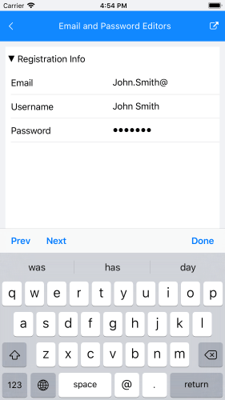

## Email and Password editors on iOS

This example will demonstrate how to add custom editors in iOS DataForm.

First, create a sample class.
 
<snippet id='dataform-howto-emailpasswordeditors-source' />

Then, setup the source and register the editor types.
 
<snippet id='dataform-howto-emailpasswordeditors-code' />

After that, you have to inherit from the default **DataFormRenderer** and override some of its methods.

<snippet id='dataform-howto-emailpasswordeditors-renderer' />

Finally, replace the default **DataFormRenderer** with the new one in **AppDelegate.cs**:

```XAML
[assembly: ExportRenderer(typeof(Telerik.XamarinForms.Input.RadDataForm), typeof(EmailPasswordEditorsRenderer))]
```
You could check the result below:


		
## See Also
- [Autocomplete editor in Android]()
- [Editors]()